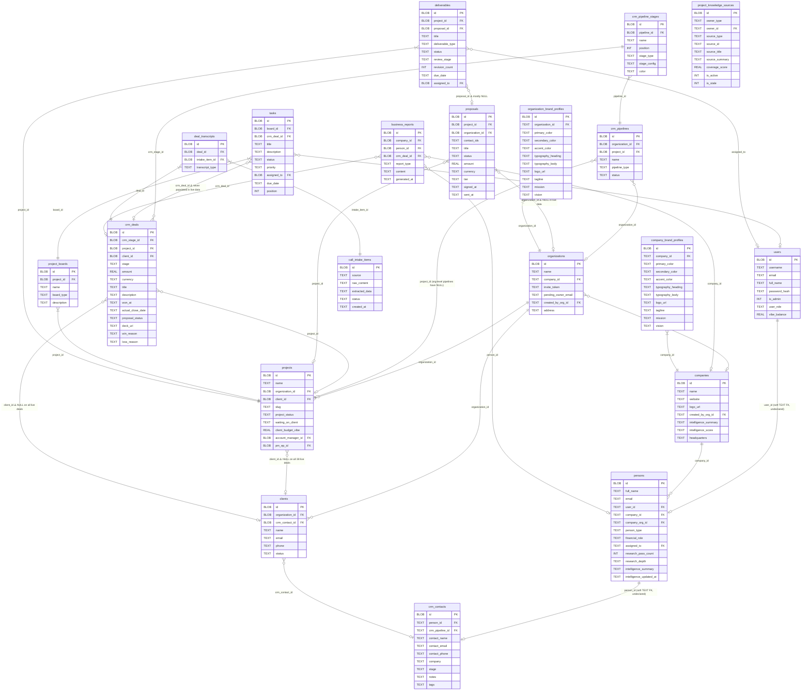
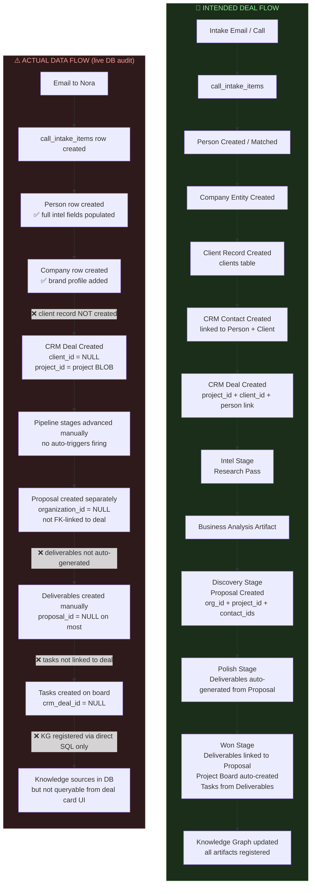
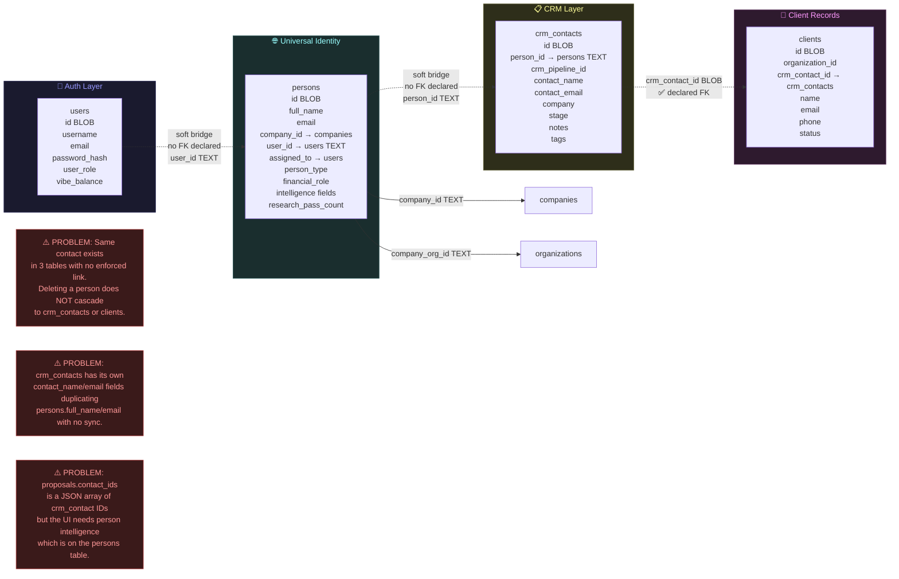
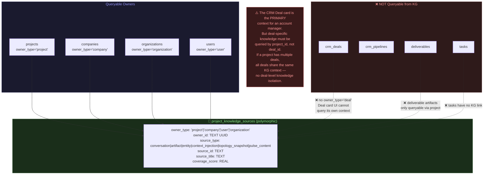
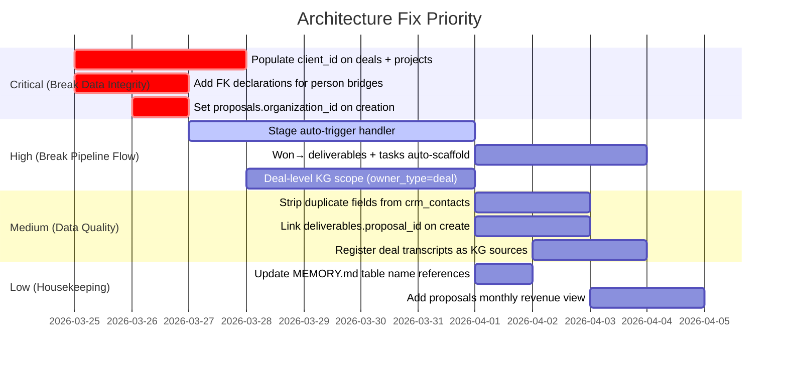

# PCG CRM/Pipeline Architecture Analysis
> Generated: 2026-03-25 | Based on live schema PRAGMA table_info + live data audit

---

## 1. Core Entity Relationship Diagram



---

## 2. Intended vs. Actual Pipeline Flow



---

## 3. Identity Layer: Triplication Problem



---

## 4. Knowledge Graph Connection Map



---

## 5. Gap Analysis: Critical Issues

### GAP-01: `client_id` Never Populated on Deals
| Field | Location | Live Value |
|-------|----------|------------|
| `crm_deals.client_id` | BLOB FK → clients | `NULL` on all 38 deals |
| `projects.client_id` | BLOB FK → clients | `NULL` on all projects |

**Impact:** The `clients` table is entirely orphaned from the pipeline. Client billing, history, and portal access cannot be linked to live deals. The `clients` table has `crm_contact_id` but `crm_contacts` don't cascade to `persons` intelligence.

**Fix:** When a deal is created, auto-populate `client_id` from the `clients` table using `crm_contact.id → clients.crm_contact_id`. If no client row exists, create it.

---

### GAP-02: Identity Bridges Are Undeclared (Soft TEXT FKs)
| Bridge | Declared? | Risk |
|--------|-----------|------|
| `persons.user_id → users.id` | ❌ TEXT, no FK | Delete user → orphaned person |
| `crm_contacts.person_id → persons.id` | ❌ TEXT, no FK | Delete person → orphaned CRM contact |
| `persons.company_id → companies.id` | ❌ TEXT, no FK | Delete company → orphaned persons |
| `crm_deals.project_id → projects.id` | ✅ BLOB FK | OK |

**Impact:** No CASCADE behavior. Deleting a person doesn't remove their CRM contacts. Searches by person ID across the CRM contact table fail unless the caller knows to join on TEXT equality.

**Fix (short-term):** Add `PRAGMA foreign_keys = ON` enforcement + application-level cascade on delete. Long-term: normalize all person bridges to a single identity table.

---

### GAP-03: `proposals.organization_id = NULL` in Live Data
| Field | Live Value |
|-------|------------|
| `proposals.organization_id` | `NULL` on all live proposals |
| `proposals.project_id` | Populated |

**Impact:** Proposals cannot be queried at the org level for agency reporting. Revenue attribution by client organization is impossible from the proposals table. Tier/contract data is not visible in org-level dashboards.

**Fix:** Set `organization_id` on proposal creation from `projects.organization_id`.

---

### GAP-04: `deliverables.proposal_id = NULL` (Broken Chain)
The intended chain is: **Proposal → Won → Deliverables → Tasks → Done**

| Link | Status |
|------|--------|
| `proposals` → create `deliverables` | ❌ NOT auto-triggered |
| `deliverables.proposal_id` | NULL on most rows |
| `deliverables` → create `tasks` | ❌ NOT auto-triggered |
| `tasks.crm_deal_id` | NULL on all live tasks |

**Impact:** Winning a deal does not automatically scaffold the delivery workflow. PMs must manually create boards, tasks, and deliverables with no linkage back to the proposal scope/value.

**Fix:** On `crm_deals` stage transition to `won`:
1. Look up linked `proposal` via `project_id`
2. Auto-create `deliverables` from proposal line items (or a deliverable template)
3. Set `deliverables.proposal_id`
4. Auto-create `project_boards` entry (if none)
5. Create `tasks` from deliverable types with `crm_deal_id` set

---

### GAP-05: Deal Card Has No Direct Knowledge Graph Scope
| Problem | Detail |
|---------|--------|
| `project_knowledge_sources` uses `owner_type='project'` | All deals for a project share the same KG |
| No `owner_type='deal'` | Deal-specific context (transcripts, proposals) not isolated |
| `deal_transcripts` exists | But transcripts are not registered as KG sources with `owner_id = deal_id` |

**Impact:** An account manager viewing a deal card cannot query "what do we know about this specific deal?" — only "what do we know about this project?" If a project has multiple client deals (e.g., upsell + renewal), their knowledge contexts bleed together.

**Fix:** Add `owner_type='deal'` support to `project_knowledge_sources`. Register deal-specific artifacts (transcripts, proposals, contracts) under `owner_id = crm_deal.id`.

---

### GAP-06: Stage Auto-Triggers Never Fire
The `crm_pipeline_stages.stage_config` JSON has `on_enter_actions` and `auto_trigger` fields, but:
- No server-side observer watches stage transitions
- `routes/automations.rs` runs 5 hourly jobs — none trigger on stage change events
- Nora's "Cash" (Proposal) and "Lux" (Polish) agent auto-triggers are defined in config but have no handler

**Impact:** Every pipeline stage advance is purely a status column update. No intelligence gathering, proposal drafting, or brand research is automatically initiated.

**Fix:** Add a `handle_stage_transition(deal_id, from_stage, to_stage)` function called from the deal PATCH handler that executes `on_enter_actions` from the new stage's `stage_config`.

---

### GAP-07: `crm_contacts` Duplicates `persons` Data
`crm_contacts` has: `contact_name`, `contact_email`, `contact_phone`, `company`
`persons` has: `full_name`, `email`, `phones` (JSON), `company_id`

These fields are populated independently with no sync. A phone number update on `persons` does not update `crm_contacts`. The CRM contact card displayed in the pipeline shows stale data.

**Fix:** Remove `contact_name`, `contact_email`, `contact_phone`, `company` from `crm_contacts` and JOIN to `persons` at query time via `person_id`. The `crm_contacts` table should be a thin pipeline-card entity, not a contact data store.

---

### GAP-08: `task_boards` / `task_cards` Don't Exist (Memory Drift)
Internal documentation and some code comments reference `task_boards` and `task_cards`. Actual tables are `project_boards` and `tasks` (with `tasks.board_id`). This naming drift causes confusion in new feature development.

**Fix:** Update all MEMORY.md entries and any frontend references to use `project_boards` / `tasks`.

---

## 6. Priority Fix Roadmap



---

## 7. Recommended Schema Additions

```sql
-- 1. Add FK declarations (migration)
ALTER TABLE persons ADD COLUMN user_id_blob BLOB REFERENCES users(id);
-- (migrate user_id TEXT → user_id_blob BLOB for FK enforcement)

-- 2. Add owner_type='deal' support (already works — just use it)
-- Register deal artifacts:
INSERT INTO project_knowledge_sources (owner_type, owner_id, source_type, source_id, ...)
VALUES ('deal', hex(crm_deal_id), 'conversation', intake_item_id, ...);

-- 3. Auto-set client_id on deal creation trigger
CREATE TRIGGER set_deal_client_id AFTER INSERT ON crm_deals
WHEN NEW.client_id IS NULL AND NEW.project_id IS NOT NULL
BEGIN
  UPDATE crm_deals SET client_id = (
    SELECT id FROM clients WHERE organization_id = (
      SELECT organization_id FROM projects WHERE id = NEW.project_id
    ) LIMIT 1
  ) WHERE id = NEW.id;
END;

-- 4. Stage transition event log (enables auto-trigger handler)
CREATE TABLE IF NOT EXISTS deal_stage_transitions (
  id         BLOB PRIMARY KEY,
  deal_id    BLOB NOT NULL REFERENCES crm_deals(id),
  from_stage TEXT,
  to_stage   TEXT NOT NULL,
  triggered_at TEXT NOT NULL DEFAULT (datetime('now','subsec')),
  actions_fired TEXT DEFAULT '[]'
);
```

---

*End of Architecture Analysis — PCG CRM/Pipeline System v0.1*
