# PCG Architecture — Extended Diagrams
> 2026-03-25 | Supplement to ARCHITECTURE_ANALYSIS.md

---

## DIAG-01: Full API Route Map (Backend Surface)

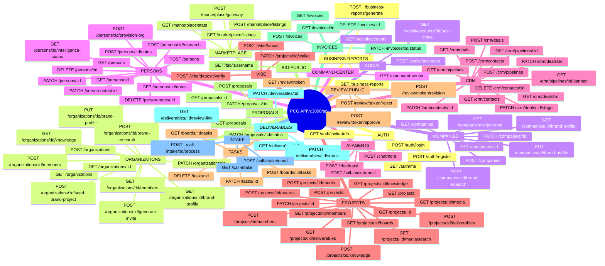

---

## DIAG-02: CRM Pipeline — 9-Stage State Machine

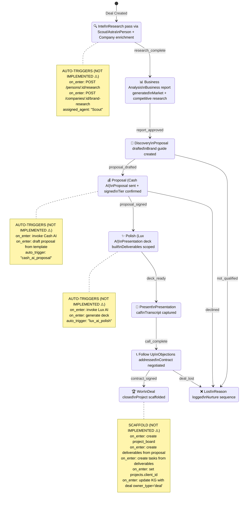

---

## DIAG-03: Intake Pipeline — Email to Deal

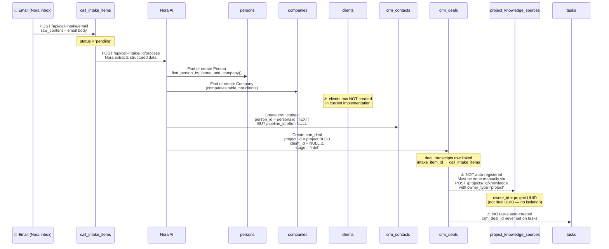

---

## DIAG-04: Won Deal → Delivery Scaffold (Intended vs. Actual)

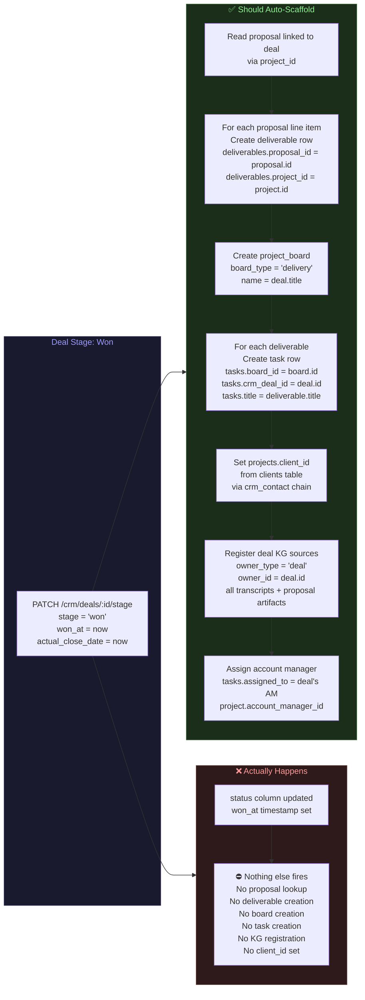

---

## DIAG-05: Organization Hierarchy & Data Ownership

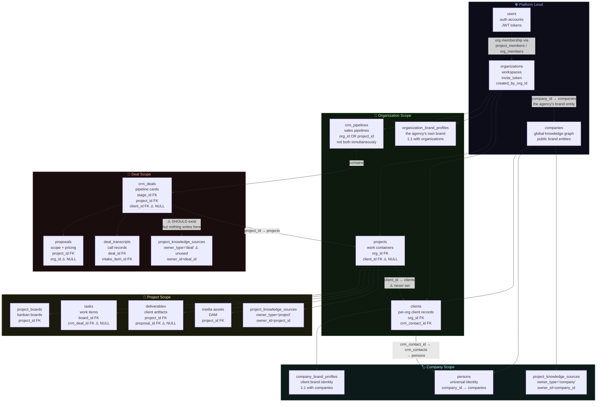

---

## DIAG-06: Brand Guide System — Two Tracks

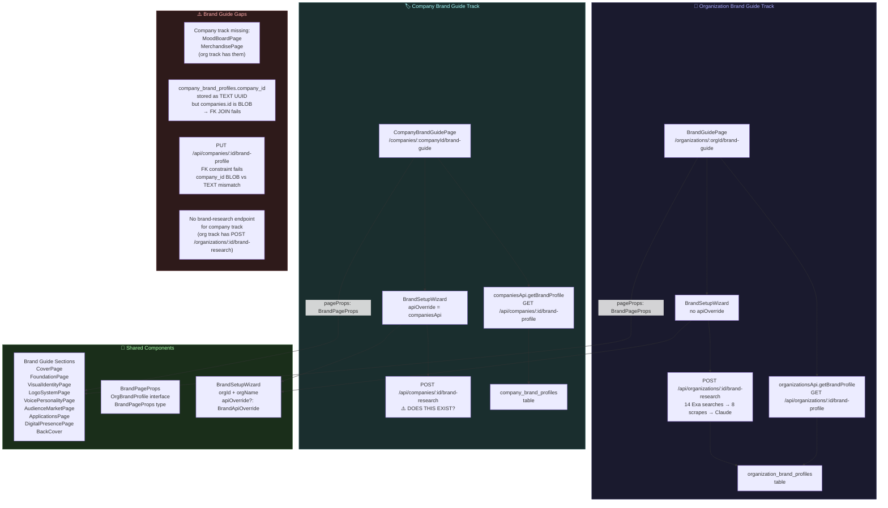

---

## DIAG-07: Knowledge Graph — What Feeds It

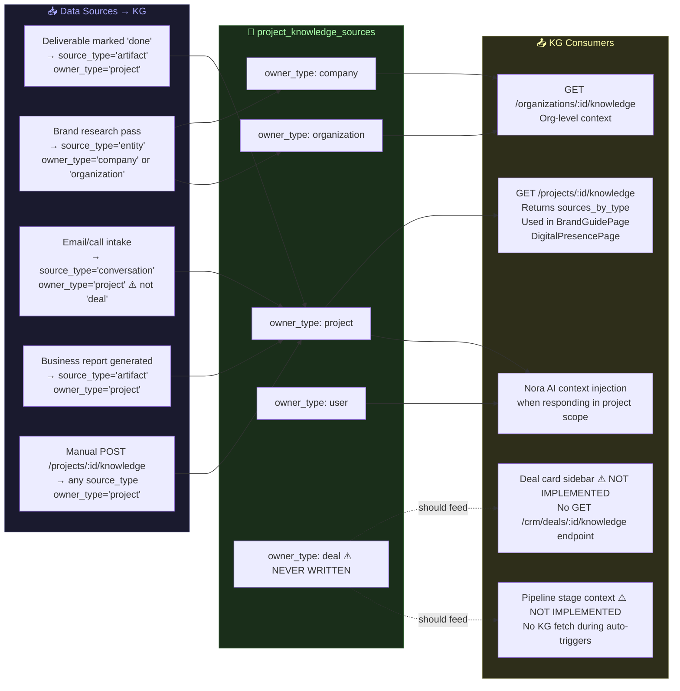

---

## DIAG-08: Automation System — What Runs vs. What Should

```mermaid
flowchart TD
    subgraph CRON["⏰ Hourly Cron (main.rs)"]
        direction TB
        CR1[automation_check_stale_knowledge\nmarks is_stale=1 if > 7 days old]
        CR2[automation_generate_weekly_reports\nif day_of_week = Monday]
        CR3[automation_sync_social_analytics\n⚠️ no connected accounts yet]
        CR4[automation_publish_scheduled_posts\n⚠️ no connected accounts yet]
        CR5[automation_update_pipeline_scores\nupdates deal health scores]
    end

    subgraph MISSING_TRIGGERS["❌ Missing Event-Driven Triggers"]
        direction TB
        MT1[Stage Transition Handler\nON PATCH /crm/deals/:id/stage\nread stage_config.on_enter_actions\nfire auto_trigger]
        MT2[Won Deal Scaffold\nON stage = 'won'\nauto-create board + tasks + deliverables]
        MT3[Proposal Signed Webhook\nON proposal.status = 'contract_signed'\nauto-advance deal to Polish]
        MT4[Deliverable Done → KG\nON deliverable.status = 'done'\nregister as KG artifact]
        MT5[New Intake → Research Queue\nON call_intake_items INSERT\nauto-POST /persons/:id/research]
        MT6[Intel Stage Enter → Scout\nON deal enters Intel stage\nqueue research pass]
    end

    subgraph MANUAL_WORKAROUNDS["🔧 Currently Done Manually"]
        direction TB
        MW1[Move deal stage via PATCH]
        MW2[Create boards manually in UI]
        MW3[Create tasks manually in UI]
        MW4[Run brand research via UI wizard]
        MW5[Register KG sources via direct SQL]
        MW6[Create deliverables manually]
    end

    CRON -->|"runs but has limited impact\nno deal-level events"| MW1
    MT1 -.->|"⚠️ not implemented"| MW1
    MT2 -.->|"⚠️ not implemented"| MW2
    MT2 -.->|"⚠️ not implemented"| MW3
    MT4 -.->|"partially implemented\nfor org deliverables only"| MW5
    MT6 -.->|"⚠️ not implemented"| MW4

    style CRON fill:#1a2e1a,stroke:#2d5a2d,color:#aaffaa
    style MISSING_TRIGGERS fill:#2e1a1a,stroke:#5a2d2d,color:#ffaaaa
    style MANUAL_WORKAROUNDS fill:#2e2e1a,stroke:#5a5a2d,color:#ffffaa
```

---

## DIAG-09: Invoice & Financial Flow

```mermaid
flowchart TD
    subgraph PROPOSAL_FINANCIAL["💰 Proposal (Contract Value)"]
        P[proposals\namount REAL\ncurrency TEXT\ntier TEXT\nstatus = contract_signed\nsigned_at TIMESTAMP]
    end

    subgraph INVOICE_FINANCIAL["🧾 Invoice (Billing)"]
        I[invoices\nperson_id FK\nproject_id FK\namount_usd REAL\nvibe_amount REAL\nstatus: pending|paid|overdue\npaid_at TIMESTAMP]
    end

    subgraph VIBE_FINANCIAL["🔮 VIBE (Internal Currency)"]
        V[vibe_transactions\nproject_id FK\nuser_id FK\ntransaction_type\namount REAL\ndescription]
        VB[users.vibe_balance\nREAL]
        VBP[projects.client_budget_vibe\nREAL]
    end

    subgraph MARKETPLACE_FINANCIAL["🛒 Marketplace Revenue"]
        M[marketplace_subscriptions\nlisting_id FK\nsubscriber_org_id FK\nvibe_per_call REAL]
        MR[gateway_requests\nsubscription_id FK\nvibe_charged REAL\nprovider_vibe REAL]
        PR[PeerReward tasks\n85% to provider\n15% platform]
    end

    subgraph GAPS_FINANCIAL["⚠️ Financial Gaps"]
        FG1["proposals ↔ invoices\nNO FK link\nCannot auto-generate invoice from signed proposal"]
        FG2["invoices.project_id\nbut NO invoices.deal_id\nCannot attribute invoice to CRM deal"]
        FG3["proposals.amount\nvs\ninvoices.amount_usd\nNo reconciliation path"]
        FG4["VIBE_PER_USD = 100\nbut vibe_transactions not\nlinked to invoices or proposals"]
    end

    P -.->|"⚠️ no auto-creation"| I
    P -->|"amount informs"| VBP
    I --> V
    V --> VB
    M --> MR --> PR

    style PROPOSAL_FINANCIAL fill:#1a2e1a,stroke:#2d5a2d,color:#aaffaa
    style INVOICE_FINANCIAL fill:#2e2e1a,stroke:#5a5a2d,color:#ffffaa
    style VIBE_FINANCIAL fill:#1a1a2e,stroke:#2d2d5a,color:#aaaaff
    style MARKETPLACE_FINANCIAL fill:#2e1a2e,stroke:#5a2d5a,color:#ffaaff
    style GAPS_FINANCIAL fill:#2e1a1a,stroke:#5a2d2d,color:#ffaaaa
```

---

## DIAG-10: CRM Contact → Person → User Merge Paths

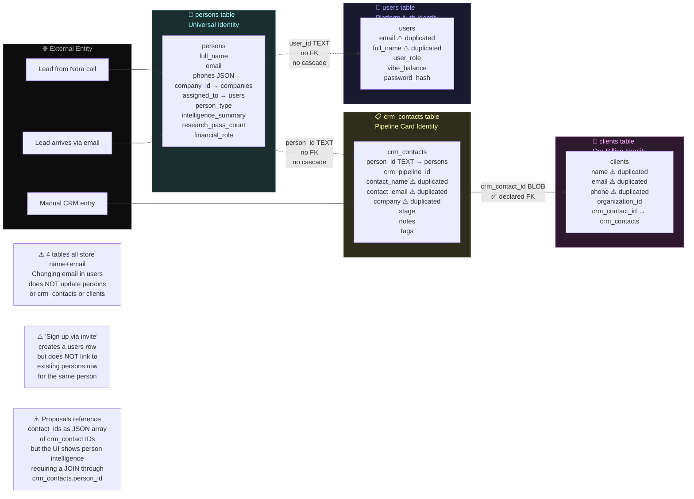

---

## DIAG-11: Dealflow — Bad Girl Strength Club Actual State

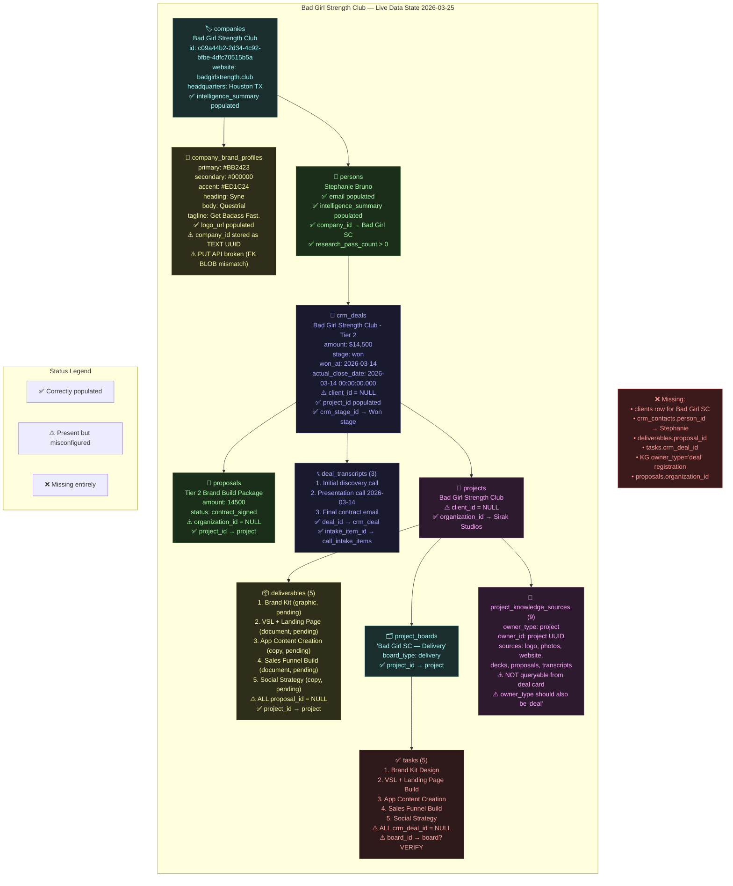

---

## DIAG-12: Proposed Target Architecture (Post-Fix)

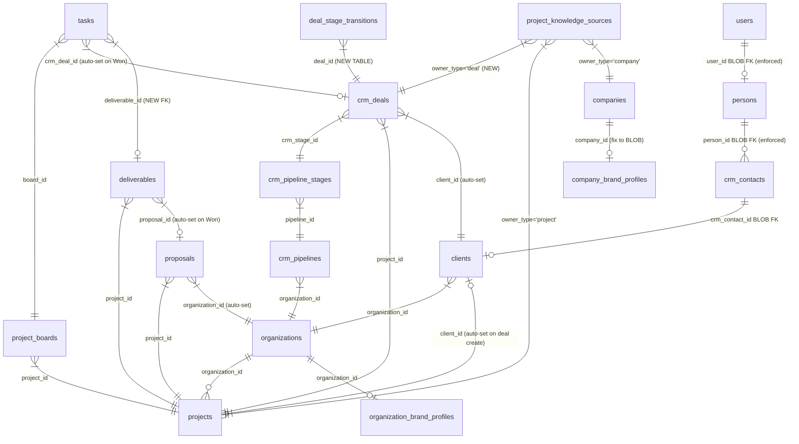

---

*End of Extended Diagrams — PCG Architecture v0.2*
