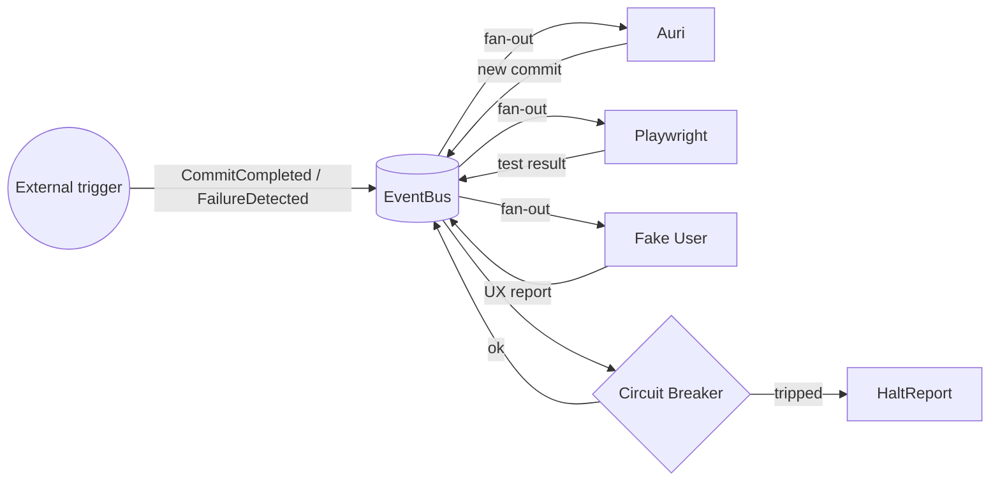
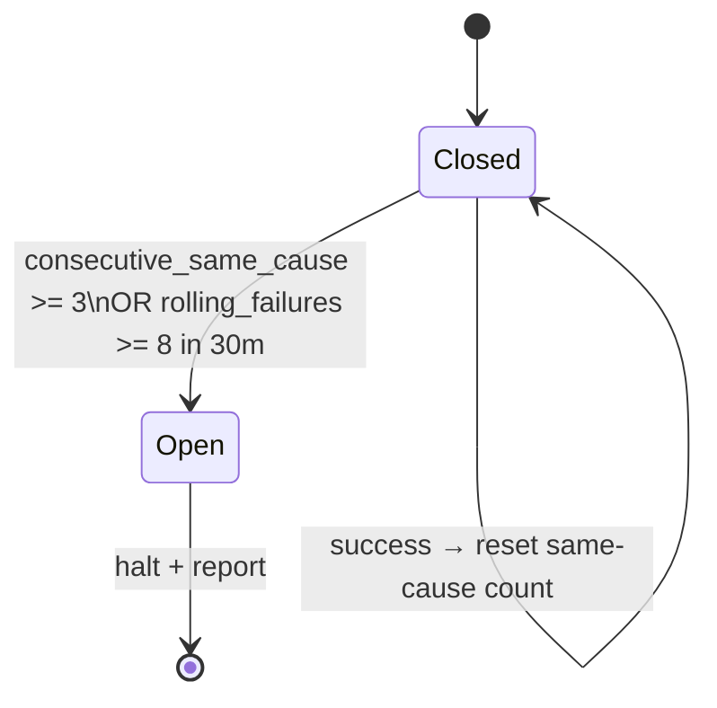

# Autonomous Dev Loop Engine — Architecture Spec

**Status**: spec for the `crates/loop-engine` skeleton landing on
`auri/58004041`. Subject to revision after Nora reviews the circuit-breaker
thresholds and the report destination.

**Reference inputs**
- Master Bodhi — original 6–8 hour autonomous loop vision.
- Madhav — reactive-trigger refinement: every commit/failure fans out to all
  three sub-agents in parallel, compounding their outputs.
- Reddit thread on the *Ralph Wiggum* failure pattern:
  https://www.reddit.com/r/ClaudeCode/comments/1q2qvta/
- Hermes Agent (Nous Research):
  https://github.com/nousresearch/hermes-agent

---

## 1. Sub-agents

| Agent              | Job                                                                 |
|--------------------|---------------------------------------------------------------------|
| **Auri**           | Coding agent. Writes code, runs `cargo`/`pnpm`, opens commits.      |
| **Playwright**     | Automated test runner. Runs the project's E2E suite on every commit.|
| **Fake User**      | UX stress agent. Drives the running app like a confused first-time user; surfaces dead clicks, broken flows, console errors. |

Each agent implements the `Agent` trait (`crates/loop-engine/src/agents/mod.rs`)
and is registered with the `Orchestrator`. The trait is back-end agnostic: a
Hermes-driven Auri, a Claude-driven Auri, and a scripted dummy all satisfy the
same shape.

## 2. Two execution modes

### 2.1 Reactive mode (default)



Every published `LoopEvent` passes through the circuit breaker. The orchestrator
itself does not gate fan-out — agents subscribe to the events they care about.
The breaker only blocks when consecutive same-cause failures or a global
failure-rate threshold is hit.

### 2.2 Sustained-loop mode (overnight)

```mermaid
flowchart TB
    Start([sustained_loop start]) --> Tick[Tick: pick next work item]
    Tick --> Auri[Auri: implement + commit]
    Auri --> PW[Playwright: run tests]
    PW --> FU[Fake User: probe UI]
    FU --> Check{Any failures?}
    Check -- no --> NextTick[Sleep until next tick] --> Tick
    Check -- yes --> Bus[(EventBus.publish FailureDetected)]
    Bus --> Reactive[Reactive fan-out\n(same as 2.1)]
    Reactive --> CB{Circuit Breaker}
    CB -- ok --> NextTick
    CB -- tripped --> Halt[HaltReport + graceful stop]
    Tick -. duration limit reached .-> Halt
```

Sustained mode is a thin wrapper around the reactive primitives — it just owns
the wall-clock timer and the "what to work on next" queue. Once it triggers an
event, the reactive path takes over.

## 3. Event model

```rust
pub enum LoopEvent {
    CommitCompleted { sha: String, author: AgentId, summary: String },
    TestsCompleted  { sha: String, passed: bool, failures: Vec<TestFailure> },
    UxReport        { sha: String, blockers: Vec<UxBlocker> },
    FailureDetected { sha: String, cause: CauseHash, detail: String, source: AgentId },
    CircuitTripped  { reason: TripReason, snapshot: CircuitSnapshot },
    LoopHalted      { final_report_path: PathBuf },
}
```

`CauseHash` is a 16-byte BLAKE3 of *normalised* failure detail — file path,
error code, top-of-stacktrace line. It collapses the noisy parts (timestamps,
PIDs) so that "the same bug retried" maps to one bucket while "two different
bugs" maps to two.

The `EventBus` is `tokio::sync::broadcast` — multiple-producer, multiple-
subscriber, with a bounded buffer. Slow subscribers drop old events rather
than block the bus.

## 4. Circuit Breaker



Two parallel detectors:

1. **Same-cause counter.** Each `FailureDetected` increments
   `same_cause[cause_hash]`. If the count hits the threshold (default 3),
   the breaker trips with `TripReason::RepeatedSameCause`.
2. **Rolling-window counter.** Keeps timestamps of all failures within the last
   30 minutes. If the count exceeds the global cap (default 8), the breaker
   trips with `TripReason::FailureRate`.

A `CommitCompleted` event *without* a failure resets the same-cause counter for
the cause hashes that the commit's diff likely addressed (best-effort: matched
file paths). The rolling-window counter never resets explicitly — entries just
age out.

Both thresholds are configurable via `CircuitBreakerConfig`. The breaker is
pure: it takes events and returns a decision. The orchestrator owns I/O.

## 5. Orchestrator

```rust
pub struct Orchestrator {
    bus: EventBus,
    breaker: CircuitBreaker,
    agents: Vec<Arc<dyn Agent>>,
    report_dir: PathBuf,
    cancel: CancellationToken,
}
```

Responsibilities:
- Own the `EventBus` and the `CircuitBreaker`.
- Spawn one driver task per registered agent. Each driver reads from a
  per-agent receiver and dispatches `agent.handle(event)` calls — with a
  per-call timeout — and forwards any returned events back to the bus.
- Subscribe its own task to the bus and, on `CircuitTripped`, cancel the
  `CancellationToken` and write the `HaltReport`.
- Expose `run_reactive()` (blocks until the breaker trips or cancel is
  triggered) and `sustained_loop(duration)` (in `sustained.rs`).

The orchestrator does **not** know what Auri/Playwright/FakeUser actually do —
they are opaque trait objects. This keeps the harness testable without
network or git.

## 6. Halt report

On trip, write `planning/reports/loop-<UTC-timestamp>.md` plus the same
content as `report.json` next to it. Contents:

- Trip reason (same-cause / rate / external cancel).
- Last 50 events (timestamp, type, summary).
- Per-agent activity summary (commits, tests run, UX issues filed).
- Top cause-hashes by frequency.
- A "what to look at first" pointer — the file paths touched in the last
  successful commit before the trip.

`planning/reports/` follows the existing planning subdirectory convention
(`planning/README.md`).

## 7. Anti-Ralph-Wiggum safeguards

| Mechanism                             | Catches                                              |
|---------------------------------------|------------------------------------------------------|
| Same-cause counter                    | "Retrying the same broken logic over and over"       |
| Rolling failure-rate counter          | "Lots of different things failing — system is sick"  |
| Per-agent call timeout                | "Agent silently hung — don't accumulate dead work"   |
| Loop-generated commit tag             | "Loop trigger loops on its own output"               |
| `CancellationToken` on Orchestrator   | "Operator wants to stop right now"                   |
| Sustained-loop wall-clock cap         | "Forgot to cancel"                                   |

## 8. Public surface (initial)

```rust
// crates/loop-engine/src/lib.rs

pub use agents::{Agent, AgentId, AgentResult};
pub use circuit_breaker::{CircuitBreaker, CircuitBreakerConfig, TripReason};
pub use events::{EventBus, LoopEvent};
pub use orchestrator::{Orchestrator, OrchestratorConfig};
pub use report::HaltReport;
pub use sustained::sustained_loop;
```

No public types depend on `axum`/`sqlx`. Wiring into the server is a future
PR — same pattern as the existing executor crate, which is consumed by both
`server` and CLI binaries.

## 9. What lands in this sprint vs next

| In this sprint | Next sprint |
|----------------|-------------|
| Crate scaffolding, compiles cleanly | Hermes back-end behind `Agent` trait |
| `CircuitBreaker` + unit tests | Real Playwright invocation |
| `EventBus`, `LoopEvent` enum | Wiring into `server` crate as SSE |
| Trait + stubs for the three agents | Test PR against the Powerclub Global web repo |
| Planning + this architecture doc | Operator UI in the React app |

## 10. References

- `planning/2026-04-13--plan--agent-flow-orchestration-engine.md` —
  the existing agent-flow engine. This loop engine sits *above* it: where
  agent-flow drives one flow through statuses, the loop engine drives the
  whole repo through commits.
- `planning/2026-04-14--plan--task-orchestration-framework.md` — the
  in-process orchestrator framework. The `Agent` trait borrows the
  in-process-teammate idea.
- `crates/STANDARDS.md` and `.claude/rules/rust-standards.md` — the rules
  every file in `crates/loop-engine` follows.
