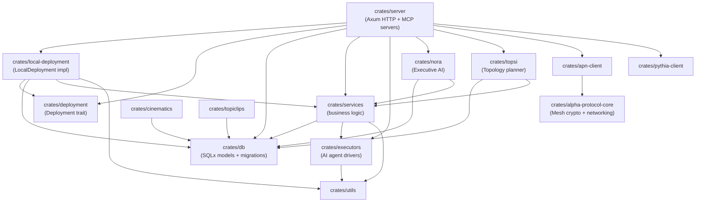
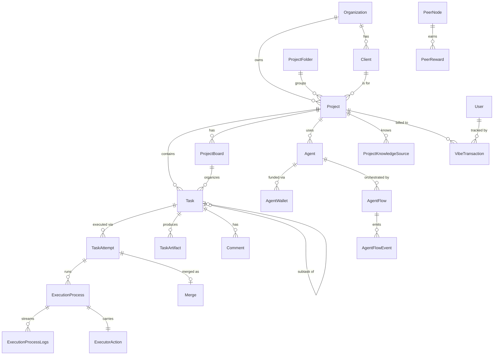
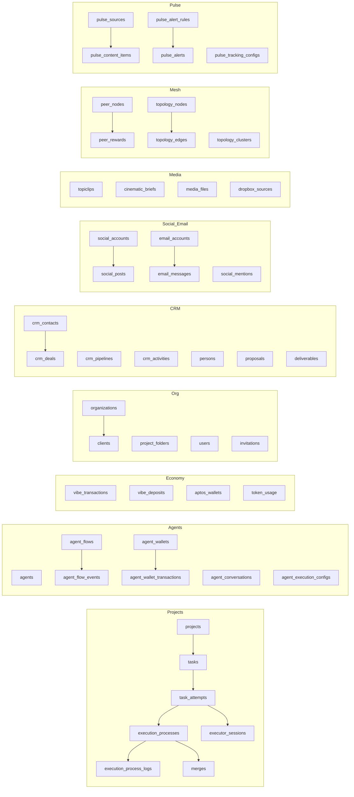
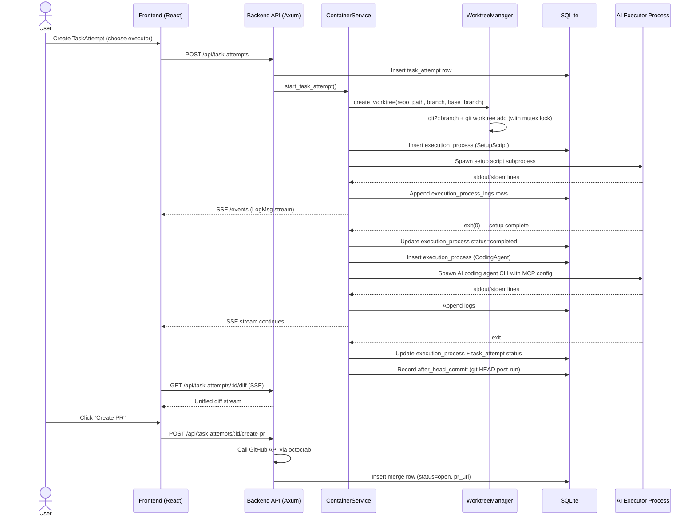
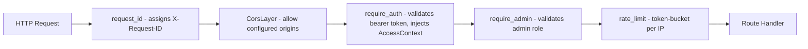
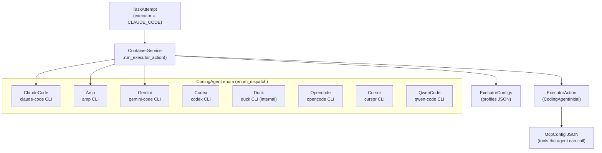
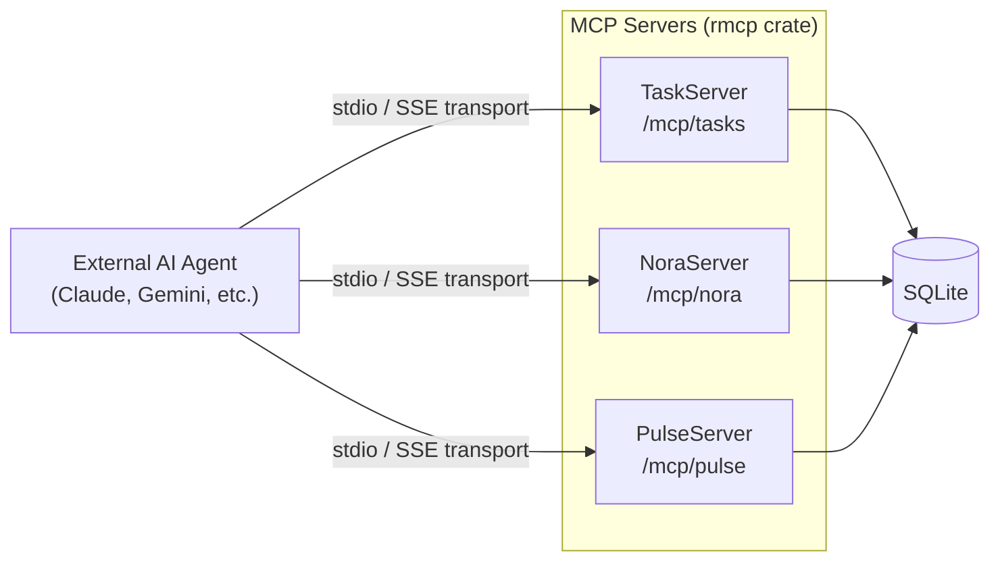
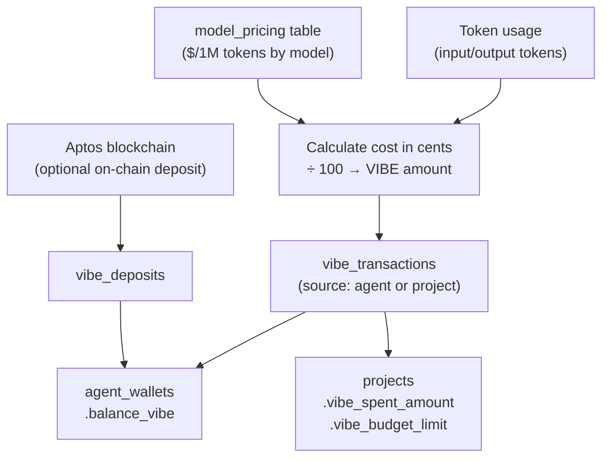
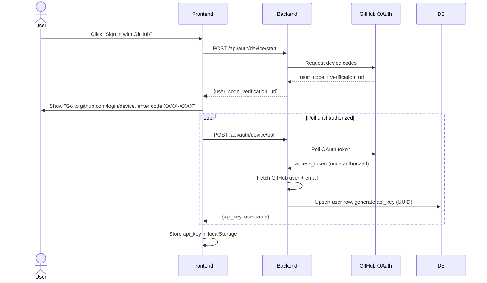
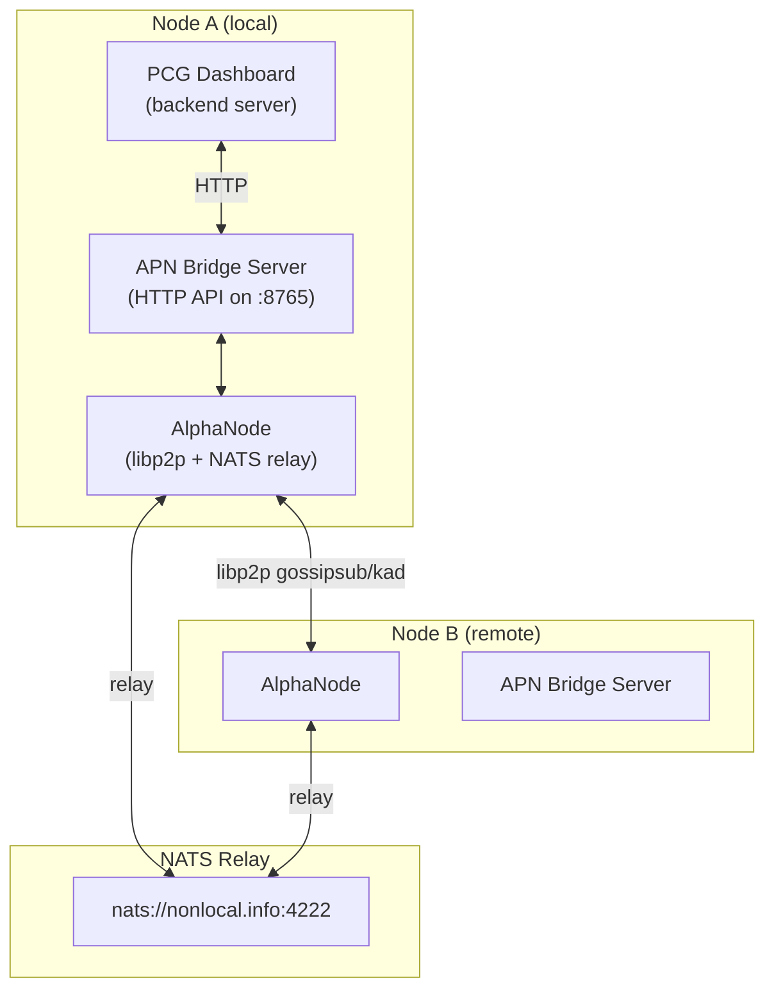

# PCG Dashboard MCP — Architecture Document

> **Audience**: Engineers onboarding to the project. You should finish this document with enough context to understand what every major subsystem does, how they talk to each other, and where to look when something goes wrong.

---

## Table of Contents

1. [Project Overview](#1-project-overview)
2. [Technology Stack](#2-technology-stack)
3. [Repository Layout](#3-repository-layout)
4. [Backend Crate Graph](#4-backend-crate-graph)
5. [Core Domain Model](#5-core-domain-model)
6. [Database Schema](#6-database-schema)
7. [Task Execution Data Flow](#7-task-execution-data-flow)
8. [API Layer & Middleware](#8-api-layer--middleware)
9. [Real-time Communication](#9-real-time-communication)
10. [AI Executor Subsystem](#10-ai-executor-subsystem)
11. [MCP Server Integration](#11-mcp-server-integration)
12. [Agent Registry & Named Agents](#12-agent-registry--named-agents)
13. [VIBE Economy & Billing](#13-vibe-economy--billing)
14. [Authentication & Access Control](#14-authentication--access-control)
15. [Alpha Protocol Network (APN)](#15-alpha-protocol-network-apn)
16. [Frontend Architecture](#16-frontend-architecture)
17. [Deployment Abstraction](#17-deployment-abstraction)
18. [Supporting Subsystems](#18-supporting-subsystems)
19. [External Integrations](#19-external-integrations)
20. [Known Architectural Concerns](#20-known-architectural-concerns)

---

## 1. Project Overview

PCG Dashboard MCP (internally also called *Vibe Kanban* / *Duck Kanban*) is a **self-hosted AI-powered project management platform** built for PowerClub Global (PCG). It sits between a Kanban-style project tracker and a full AI orchestration layer.

Its core loop is:

> A human (or an AI agent) creates a **Task** → an AI **coding agent** (Claude, Gemini, AMP, etc.) picks it up inside an isolated git **worktree** → the agent produces code changes → the human reviews and merges.

On top of that core loop the platform has grown to include:

- **Nora** — an executive AI assistant/COO persona with voice capabilities  
- **Topsi** — a "topological super intelligence" that reasons about the whole project ecosystem  
- **Alpha Protocol Network (APN)** — a sovereign mesh networking layer (libp2p + NATS relay)  
- **VIBE** — an internal economy where LLM token costs are represented as credits (1 VIBE = $0.01 USD), bridged optionally to the Aptos blockchain  
- **CRM, Social, Email, Pulse, CMS** — a growing suite of business tools the platform hosts for PCG clients  

---

## 2. Technology Stack

| Layer | Technology |
|---|---|
| Backend language | Rust (Tokio async, Axum HTTP) |
| Database | SQLite via SQLx (optional PostgreSQL path exists) |
| Type sharing | ts-rs — Rust structs derive TypeScript types |
| ORM | SQLx (compile-time verified queries, offline mode) |
| Frontend | React 18 + TypeScript + Vite + Tailwind CSS + shadcn/ui |
| Desktop wrapper | Tauri v2 (optional — same backend binary) |
| Mesh networking | libp2p (gossipsub, Kademlia, mDNS, Noise), NATS relay |
| Blockchain | Aptos Move (wallet + on-chain VIBE deposits) |
| Auth | GitHub OAuth Device Flow + API-key bearer tokens |
| Error tracking | Sentry |
| Analytics | PostHog (opt-in) |
| Package managers | pnpm (workspace), Cargo |
| Distribution | `npx pcg-dashboard` CLI bootstrapper |

---

## 3. Repository Layout

```
pcg-cc-mcp/
├── crates/                # All Rust workspace members
│   ├── server/            # Main HTTP server — routes, MCP servers, middleware
│   ├── db/                # SQLx models, migrations, query helpers
│   ├── executors/         # AI coding-agent driver implementations
│   ├── services/          # Business logic (container, git, worktree, auth …)
│   ├── utils/             # Cross-cutting utilities (assets, ports, sentry, …)
│   ├── local-deployment/  # LocalDeployment: ties services together for dev/prod
│   ├── deployment/        # Deployment trait (interface between server and impl)
│   ├── nora/              # Nora executive AI — brain, tools, workflow, voice
│   ├── topsi/             # Topsi topology planner / master AI controller
│   ├── alpha-protocol-core/ # Mesh networking primitives (identity, crypto, wire)
│   ├── apn-client/        # Client for the APN node bridge
│   ├── pythia-client/     # Client for the Pythia master node
│   ├── cinematics/        # Cinematic brief / media production support
│   ├── topiclips/         # Short-form video clip management
│   ├── cli/               # CLI helpers
│   ├── setup-wizard/      # First-run setup wizard
│   └── editron-runner/    # Editron video editor integration runner
├── frontend/
│   ├── src/               # React application
│   │   ├── pages/         # Route-level page components (lazy loaded)
│   │   ├── components/    # Shared UI components, dialogs, layout
│   │   ├── hooks/         # Custom React hooks (data fetching, SSE, WebSocket)
│   │   ├── contexts/      # React contexts (Auth, Project, Search, Keyboard)
│   │   ├── stores/        # Zustand stores (if any)
│   │   └── lib/           # API client, type utilities
│   └── src-tauri/         # Tauri shell for desktop builds
├── shared/types.ts        # Auto-generated TypeScript types (DO NOT edit manually)
├── npx-cli/               # npm CLI bootstrap package
├── scripts/               # Dev setup helpers (port allocation, DB prep)
├── assets/                # Bundled static assets
├── dev_assets/            # Local dev database and runtime assets
├── dev_assets_seed/       # Seed database copied on dev server start
└── migrations/            # Root-level standalone migration scripts (legacy)
```

---

## 4. Backend Crate Graph



The dependency direction is strictly top-down: `server` → `deployment` → `services` → `db` → `utils`. No lower crate reaches upward into `server`.

---

## 5. Core Domain Model

The central entities and their relationships are:



### Key Entity Descriptions

| Entity | Purpose |
|---|---|
| **Project** | Home for a git repository + all tasks. Carries optional setup/cleanup/dev scripts, VIBE budget, and org/client/folder associations. |
| **Task** | A unit of work. Status: `todo → inprogress → inreview → done / cancelled`. Has priority, optional assignee (human or agent), due date, custom properties. |
| **TaskAttempt** | One execution attempt on a task by a specific AI executor. Gets its own git worktree/branch. Multiple attempts per task are allowed. |
| **ExecutionProcess** | A single subprocess spawned within a TaskAttempt (setup script, coding agent run, dev server, cleanup script). Tracks before/after git HEAD commits. |
| **ExecutionProcessLogs** | Streaming log lines from an ExecutionProcess, persisted for replay. |
| **ExecutorSession** | One session of an AI coding agent's lifecycle within an attempt. |
| **Agent** | A named AI agent registered in the platform (e.g. Nora, Maci, Editron). Has personality config, capabilities, autonomy level, and VIBE wallet. |
| **AgentFlow** | A multi-step automated pipeline involving one or more agents. Emits `AgentFlowEvent` rows for SSE streaming. |
| **Merge** | A record of a TaskAttempt's branch being merged (PR URL, commit, status). |
| **VibeTransaction** | Ledger entry for AI token spend. Tied to a task and/or agent; tracks raw tokens + calculated cost in cents. |

---

## 6. Database Schema

The database is SQLite (file at `dev_assets/db.sqlite`). It has grown through **100+ incremental migrations** under `crates/db/migrations/`. The schema uses UUIDs stored as BLOBs, ISO-8601 datetimes stored as TEXT, and JSON blobs for flexible fields.

### Foundational Tables (from first migration, June 2025)

```
projects → tasks → task_attempts
```

### Current Major Table Groups



### Notable Schema Patterns

- **Soft-delete**: Most tables have `deleted_at` columns added via late migrations, used instead of hard deletes.  
- **Custom properties**: Tasks (and several other entities) have a `custom_properties JSON` column for arbitrary metadata without schema changes.  
- **Executor action**: Stored as a JSON blob on `execution_processes.executor_action` — a tagged union matching the `ExecutorAction` Rust enum.  
- **VIBE budget**: Projects carry `vibe_budget_limit` (nullable = unlimited) and `vibe_spent_amount` kept in sync via triggers/application logic.  
- **Migration is append-only**: Destructive changes are done by adding new columns/tables and backfilling, not by dropping things mid-flight.

---

## 7. Task Execution Data Flow

This is the most important flow to understand — everything else is either set-up for it or downstream of it.



### Worktree Lifecycle

Each TaskAttempt gets an isolated git worktree checked out to a new branch (`task/{task_id}/{attempt_id}`). This means:

- Multiple attempts on different tasks can run in parallel against the same repo  
- Attempts don't interfere with the main working tree  
- The worktree path is stored in `task_attempts.container_ref`  
- On cleanup, the worktree is removed from disk and `worktree_deleted = true` is set  
- A background orphan-cleanup job runs on startup to remove worktrees whose DB records are gone  

### Executor Action Model

An `ExecutorAction` is the typed instruction given to an `ExecutionProcess`:

```
ExecutorAction
├── CodingAgentInitial  { prompt, mcp_config, profile, … }
├── CodingAgentFollowUp { prompt, session_id, … }
└── Script              { command, language, context }
```

The action is serialized to JSON and persisted. On replay or resume, it is deserialized back to drive the same process.

---

## 8. API Layer & Middleware

### Route Structure

Routes are split into three tiers in `crates/server/src/routes/mod.rs`:

```
/health           ─── public (no auth)
/metrics          ─── public (Prometheus format)
/events           ─── public SSE stream
/api/auth/*       ─── public (GitHub device flow)
/api/config/*     ─── public
/api/<most>/*     ─── protected (require_auth middleware)
/api/users/*      ─── admin-only (require_admin middleware)
```

There are **~90 route modules**, covering everything from core task management to social posts, CRM, invoices, and Orcha routing.

### Middleware Stack (innermost to outermost)



- **`require_auth`**: Reads the `Authorization: Bearer <token>` header. Validates against `users.api_key` in the DB or a session token. Injects an `AccessContext` extension carrying the current user and their project-level roles.  
- **`require_admin`**: Applied as a sub-layer on top of `require_auth` for admin-only routes — checks `users.is_admin`.  
- **Model loaders**: Several routes use `Extension`-based middleware that pre-loads a `Task` or `TaskAttempt` from the DB before the handler runs (`load_task_middleware`, `load_task_attempt_middleware`), reducing boilerplate.

### `Deployment` Trait

Every route handler receives `State(deployment): State<DeploymentImpl>`. The `Deployment` trait (in `crates/deployment`) is the central service locator — it exposes `db()`, `container()`, `git()`, `auth()`, `events()`, and other service handles. In practice there is only one implementation (`LocalDeployment`), but the trait makes it straightforward to add a cloud or test implementation.

---

## 9. Real-time Communication

The frontend receives live updates via two mechanisms:

### Server-Sent Events (SSE)

| Endpoint | What it streams |
|---|---|
| `GET /events` | All execution log lines (`LogMsg`) for the current session — history first, then live |
| `GET /api/events/processes/:id/logs` | Log lines for a specific `ExecutionProcess` |
| `GET /api/events/task-attempts/:id/diff` | Unified diff as it accumulates |
| `GET /api/events/flows/:id` | `AgentFlowEvent` rows for a specific `AgentFlow` |
| `GET /api/events/all` | All recent flow events across all flows |

The SSE log stream is backed by an in-memory `MsgStore` (a bounded ring-buffer with replay). Log lines written by the container service are appended to the `MsgStore` AND persisted to `execution_process_logs` rows for durable replay after a restart.

### WebSocket

| Endpoint | What it pushes |
|---|---|
| `GET /api/tasks/stream?project_id=…` | Full task list re-pushed on any change (polling at ~1 s) |
| `GET /api/task-attempts/stream?task_id=…` | TaskAttempt list for a task, re-pushed on change |

These are simple poll-and-push WebSockets: the backend polls the DB every second and pushes the updated list if the content differs from the last push. There is no change-data-capture or notification mechanism at the DB level.

---

## 10. AI Executor Subsystem



### How Executors Work

Each executor implements `StandardCodingAgentExecutor` (via `enum_dispatch`). The trait has two key methods:

- `run_initial(action, worktree_path, mcp_config, …)` — spawns the CLI process with the initial prompt  
- `run_follow_up(action, session_id, …)` — continues an existing session (supported only by executors with `SessionFork` capability)  

Executors are spawned as child process groups (using `command-group`) so that the entire process tree can be killed together. stdout/stderr are piped back through `stdout_dup` which fans output to:

1. The in-memory `MsgStore` (SSE stream)  
2. The `execution_process_logs` table  

### Executor Profiles

`ExecutorConfigs` loads from `crates/executors/default_profiles.json` (bundled in the binary) and from `~/.config/pcg-dashboard/executor_profiles.json` (user overrides). A profile specifies which executor variant to use and what MCP server config to inject.

The recommended profile is auto-detected by probing for installed CLIs at startup.

---

## 11. MCP Server Integration

The platform exposes **three MCP (Model Context Protocol) servers** that AI agents can connect to:



### TaskServer Tools

| Tool | Description |
|---|---|
| `list_projects` | List all projects with git paths and scripts |
| `list_tasks` | List tasks in a project, optionally filtered by status |
| `create_task` | Create a new task in a project |
| `update_task` | Update title/description/status of a task |
| `get_task_details` | Full task detail + attempt status |
| `start_task_attempt` | Trigger execution of a task |
| `get_execution_status` | Poll execution status |

### How It Fits Together

When an AI coding agent is launched inside a worktree, it receives an MCP config JSON (`default_mcp.json` merged with profile overrides) that tells it the URL of the local TaskServer. This way the coding agent can **read and update tasks** as it works — it's a feedback loop: the agent modifies code AND updates the task status.

The `pcg-cc-mcp` npm package (entry: `npx-cli/bin/mcp.js`) bootstraps the backend binary and exposes just the MCP server to external AI tools like Claude Desktop or Cursor.

---

## 12. Agent Registry & Named Agents

Beyond anonymous executor runs, the platform has a first-class **agent registry** — specific named AI personas with persistent identities:

| Agent | Role |
|---|---|
| **Nora** | Executive AI / COO persona. Has voice (Twilio + Piper TTS), memory, personality, workflow orchestration, and a direct HTTP/WebSocket API under `/api/nora/`. |
| **Maci** | Image generation agent (ComfyUI backend). |
| **Editron** | Video editor agent (Editron runner backend). |
| Custom agents | Any number of agents can be seeded into the `agents` table with full capability + personality config. |

Agents have:
- An **autonomy level** (`full`, `supervised`, `approval_required`, `manual`)  
- A **VIBE wallet** (`agent_wallets` + `agent_wallet_transactions`)  
- **Capabilities** defined as JSON (tool access, proficiency levels)  
- An **AgentExecutionConfig** controlling which LLM model/provider/temperature to use  

### Nora Architecture

`crates/nora` is a standalone crate with:

```
nora/
├── agent.rs        # NoraAgent: top-level coordinator
├── brain.rs        # LLM interface (LLMConfig, provider abstraction)
├── coordination.rs # CoordinationManager: routes events between agents
├── execution.rs    # ExecutionEngine, ExecutionRouter, EventBroadcaster
├── graph.rs        # GraphOrchestrator: DAG-based task planning
├── memory.rs       # ConversationMemory, ExecutiveContext
├── personality.rs  # BritishPersonality, signature phrases
├── tools.rs        # NoraExecutiveTool enum (MCP tools Nora can call)
├── voice.rs        # VoiceEngine (TTS via Piper), SpeechRequest/Response
└── workflow.rs     # WorkflowOrchestrator, WorkflowInstance
```

### Topsi Architecture

`crates/topsi` introduces the concept of **topology** as a first-class object — the entire project ecosystem is modeled as a live graph of nodes (agents, tasks, resources) and edges (dependencies, data flows):

```
topsi/
├── topology/
│   ├── graph.rs     # TopologyGraph, GraphNode, GraphEdge, ClusterInfo
│   ├── engine.rs    # TopologyEngine: maintains live graph state
│   ├── patterns.rs  # PatternDetector: finds bottlenecks, holes
│   ├── routing.rs   # RoutePlanner: finds alternate execution paths
│   └── clusters.rs  # ClusterManager: dynamic agent team formation
├── prioritization/  # EFE (Expected Free Energy) calculation for task priority
└── meeting.rs       # MeetingManager: voice-based meeting sessions
```

---

## 13. VIBE Economy & Billing

VIBE is the internal unit of economic value. 1 VIBE = $0.01 USD.



- Every LLM call records a `token_usage` row, which triggers a `vibe_transaction` row.  
- Projects can have a `vibe_budget_limit`. When `vibe_spent_amount` reaches the limit, new executions are blocked.  
- Agents have wallets so they can be "funded" and independently pay for their own LLM usage.  
- Aptos integration (`crates/db/models/aptos.rs`, `routes/aptos.rs`) allows users to deposit VIBE on-chain and have it credited to their wallet.

---

## 14. Authentication & Access Control

### User Authentication



All subsequent API requests send `Authorization: Bearer <api_key>`.

### Roles and Access

| Scope | Mechanism |
|---|---|
| Platform admin | `users.is_admin = true` |
| Project access | `project_members` table: role = `owner / editor / viewer` |
| Board-level sharing | `board_shares` table (read/write per board per user) |
| MCP access | Bearer token from `users.api_key` (same as UI) |

The `AccessContext` struct (injected by `require_auth` middleware) provides a `check_project_access(project_id, required_role)` method used in every protected handler.

---

## 15. Alpha Protocol Network (APN)

APN is a sovereign mesh networking layer that enables:

- **Peer discovery** — mDNS on LAN, Kademlia DHT on the internet  
- **Encrypted messaging** — Ed25519 identity, X25519 key exchange, ChaCha20-Poly1305 encryption  
- **NAT traversal** — NATS relay at `nats://nonlocal.info:4222` as fallback  
- **Peer rewards** — Nodes earn VIBE for contributing CPU, storage, and bandwidth  



The main backend queries APN status via `initialize_external_services()` at startup and logs whether the APN node and bridge are running. If they are not running, mesh features degrade gracefully to log fallbacks.

Peer rewards are recorded in `peer_rewards` and `peer_nodes` tables. The `alpha-protocol-core` crate contains the economic primitives: `ResourceContribution`, `ResourceTracker`, `RewardRates`, `StakePool`, etc.

---

## 16. Frontend Architecture

### Page Structure

The React app is a single-page application with React Router. All pages are **lazy-loaded** to keep the initial bundle small.

```
/ (root)                        → redirect to /projects or /login
/login                          → LoginPage (GitHub OAuth)
/projects                       → Projects list
/projects/:id/tasks             → Kanban board for a project
/projects/:id/controller        → ProjectController page
/my-tasks                       → Tasks assigned to current user
/global-tasks                   → All tasks across projects
/nora                           → Nora AI chat + voice
/topsi                          → Topsi intelligence dashboard
/mission-control                → Mission control console
/mesh                           → APN mesh network view
/vibe                           → VIBE economy dashboard
/pulse                          → Pulse content monitoring
/social                         → Social media management
/crm                            → CRM overview
/crm/clients                    → Client list
/knowledge                      → Project knowledge base
/workflows                      → Workflow templates
/settings/*                     → User and project settings
/people                         → Persons CRM
/proposals                      → Proposals management
/invoices                       → Invoices
```

### Component Hierarchy

```
App
├── AuthProvider        (GitHub auth state)
├── ThemeProvider       (dark/light mode)
├── ProjectProvider     (active project context)
├── SearchProvider      (global search)
├── KeyboardShortcutsProvider
├── NiceModal.Provider  (modal management via @ebay/nice-modal-react)
├── Navbar              (top bar + user menu)
├── Sidebar             (navigation)
└── <Page Component>    (lazy loaded per route)
    └── TaskCard        (per task — shows executor, status, VIBE cost, collaborators)
        └── TaskDetailPanel / TaskAttemptPanel
```

### Data Fetching Pattern

- Most data is fetched via plain `fetch()` calls to the backend REST API and stored in component state  
- Task lists use **WebSocket streams** (`useTaskStream` hook) for live updates  
- Execution logs use **SSE** (`useEventSourceManager` hook) that manages keepalives, reconnect, and message buffering  
- The `shared/types.ts` file provides full TypeScript type safety for all API payloads (generated by ts-rs from Rust structs)  

### Dialogs

Dialogs are globally registered with `NiceModal.create()` and shown from anywhere with `NiceModal.show(DialogName, props)`. They live in `frontend/src/components/dialogs/`.

---

## 17. Deployment Abstraction

The `Deployment` trait (`crates/deployment`) is the central abstraction for runtime-environment concerns. Every route handler depends on it via `State<DeploymentImpl>`.

```rust
trait Deployment {
    fn db(&self) -> &DBService;          // SQLite pool
    fn container(&self) -> &impl ContainerService; // Worktree + executor orchestration
    fn git(&self) -> &GitService;
    fn auth(&self) -> &AuthService;
    fn events(&self) -> &EventService;   // SSE MsgStore
    async fn stream_events(&self) -> impl Stream<…>;
    async fn cleanup_orphan_executions(&self);
    async fn spawn_pr_monitor_service(&self);
    async fn sync_from_topos(&self);
    // … many more
}
```

`LocalDeployment` (the only current implementation) wires together all service instances and holds them in `Arc<RwLock<…>>` where shared mutability is needed. It is `Clone` (all inner fields are `Arc`-wrapped), which is how Axum distributes it across request handlers.

### Startup Sequence

```
main()
  1. Install rustls crypto provider
  2. Load .env
  3. Initialize tracing (tracing-subscriber + Sentry layer)
  4. Ensure asset directory exists
  5. initialize_external_services() — probe APN node/bridge, Ollama, ComfyUI
  6. LocalDeployment::new()
     a. Load config from disk (executor profile, onboarding state)
     b. Initialize DB + run pending migrations (sqlx::migrate!())
     c. Spawn EventService, ImageService, MediaPipelineService, …
  7. cleanup_orphan_executions() — kill/remove any stale worktrees from last run
  8. backfill_before_head_commits() — fill missing pre-run git HEAD snapshots
  9. spawn_pr_monitor_service() — background task polls GitHub for PR merges
  10. sync_from_topos() — import projects from TOPOS_DIR (if configured)
  11. Seed core agents (Nora, Maci, Editron) via AgentRegistryService
  12. Start Axum HTTP server on BACKEND_PORT
  13. Open browser (if not headless)
```

---

## 18. Supporting Subsystems

### Pulse Engine

Pulse is a content-monitoring system that watches configured sources (RSS, web, social) and surfaces relevant items to the user. Tables: `pulse_sources`, `pulse_content_items`, `pulse_tracking_configs`, `pulse_alert_rules`, `pulse_alerts`. It has its own MCP server (`pulse_server`) so AI agents can query it.

### Orcha Routing

`orcha_routing.rs` (in `server`) implements a tier-based routing system for AI model selection. Different tiers (light, standard, heavy, …) map to different model providers. Route decisions are logged and exposed via `/api/orcha`.

### Topsi Topology

Topology data is persisted in `topology_nodes`, `topology_edges`, `topology_clusters`, `topology_routes`, and `topology_issues`. The `TopologyEngine` maintains and queries this graph. The `PatternDetector` looks for bottlenecks (high in-degree nodes), orphan nodes, and emerging clusters. This is used by Topsi's AI to make recommendations about task prioritization and agent assignment.

### CMS

A content management system for PCG's web presence. Tables: `cms_sites`, `cms_pages`, `cms_page_sections`, `cms_products`, `cms_faq_items`, `cms_site_settings`. Exposed via `/api/cms/*` routes.

### Cinematics / TopiClips

`crates/cinematics` handles cinematic brief production (video production planning). `crates/topiclips` manages short-form video clips. Both have DB models and dedicated route modules.

### Editron Integration

Editron is an external video editor. `crates/editron-runner` (runner only, no lib exposed) drives it. The platform tracks Editron tasks, exports, and dashboard data via `editron_export` routes and `editron_tracking` in the nora crate.

### Task Scheduler

`task_scheduler.rs` in the server crate provides a background job loop for periodic tasks (e.g. recurring task creation from templates, scheduled cleanups).

---

## 19. External Integrations

| Integration | How it's used |
|---|---|
| **GitHub** | OAuth Device Flow for auth; octocrab for PR creation, branch management, repo operations |
| **Airtable** | Sync records to/from `airtable_bases` and `airtable_record_links` tables |
| **Dropbox** | Source for media files via `dropbox_sources`; background `DropboxMonitor` polls for new content |
| **Twilio** | Inbound/outbound SMS and voice calls. `twilio_sms.rs` handles webhook parsing. Nora can make/receive calls. |
| **Aptos** | On-chain wallet for VIBE deposits. `routes/aptos.rs` handles wallet registration and transaction verification. |
| **PostHog** | Anonymous analytics events (opt-in). `services/analytics.rs` wraps the HTTP API. |
| **Sentry** | Error reporting. Set up in `utils/sentry.rs`; a tracing layer forwards panic/error events. |
| **Ollama** | Local LLM inference. Checked at startup; agents fall back to cloud if unavailable. |
| **ComfyUI** | Local image generation for Maci. Checked at startup. |
| **NATS** | Mesh relay for APN NAT traversal. Default: `nats://nonlocal.info:4222`. |

---

## 20. Known Architectural Concerns

These are observable patterns in the codebase that a new developer should be aware of — they are not necessarily bugs but represent design trade-offs or areas of potential friction:

### Database Growth & Complexity
The schema has grown via 100+ additive migrations. Many tables have accumulated nullable columns that represent distinct lifecycle phases bolted on after the fact (e.g. the many optional fields on `execution_processes`). This makes it hard to reason about what a "valid" row looks like without reading all migrations.

### WebSocket Polling Instead of Push
Task and TaskAttempt WebSocket endpoints poll the database every ~1 second and push the full list. At scale (many concurrent users, large task lists) this will become expensive. There is no change-data-capture, DB triggers for notifications, or in-process event bus for task state changes.

### Single SQLite File
SQLite is the only database in production use. This limits write concurrency and horizontal scalability. A PostgreSQL code path exists (`cfg(feature = "postgres")`) but is conditionally compiled out and appears incomplete — `PgDBService` references exist in `local-deployment` but are never activated.

### Monolithic `LocalDeployment`
`LocalDeployment` directly holds instances of ~15 services. As the platform grows this struct becomes harder to test, mock, or refactor. There is no dependency injection container; everything is wired by hand in `LocalDeployment::new()`.

### Incomplete MsgStore for Log Replay
The in-memory `MsgStore` ring-buffer is the primary streaming mechanism for execution logs. It does not survive a server restart. On restart, logs are served from `execution_process_logs` rows, but the handoff logic between the two sources is non-trivial and there are edge cases where logs spanning a restart may appear out of order or have gaps.

### Breadth vs. Depth
The platform covers an enormous surface area (CRM, social, CMS, mesh networking, blockchain, video production, etc.). Many of these modules are at an early/sketch stage — routes exist, DB tables exist, but business logic and frontend surfaces are incomplete. A new developer should calibrate expectations: not everything under `/api/*` is production-ready.

### Type Generation is Manual
`shared/types.ts` is regenerated by running `npm run generate-types`. If a Rust type changes and this is not re-run before merging, the frontend TypeScript types go stale. The CI check (`generate-types:check`) guards against this but only in CI, not during local development.

---

*Last updated: auto-generated via codebase audit — March 2026*
