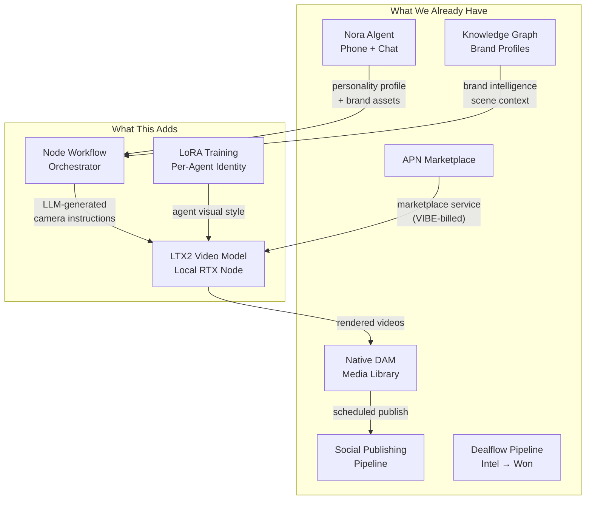
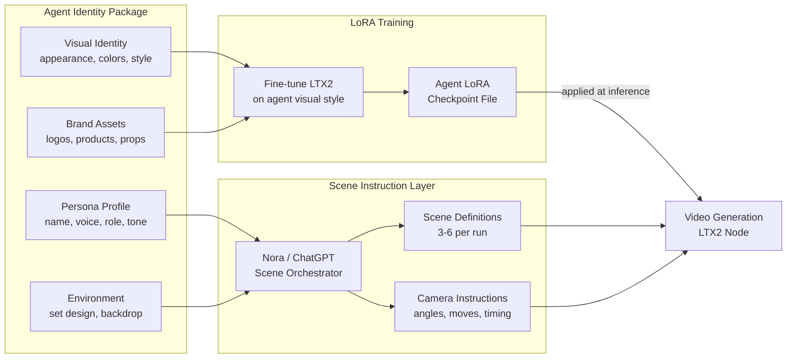
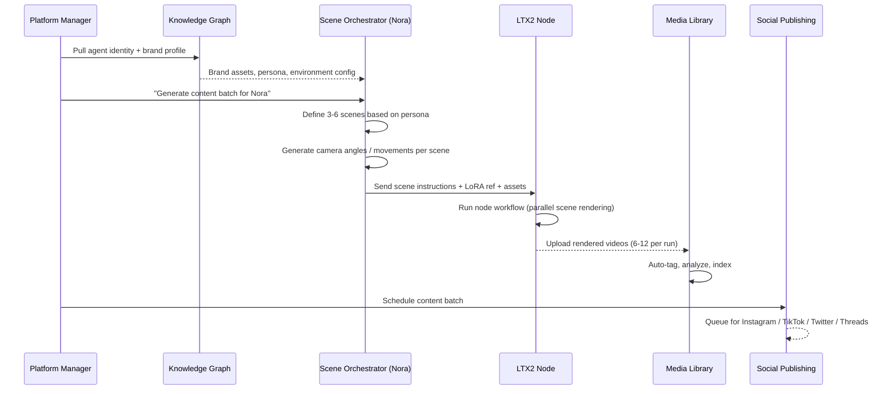
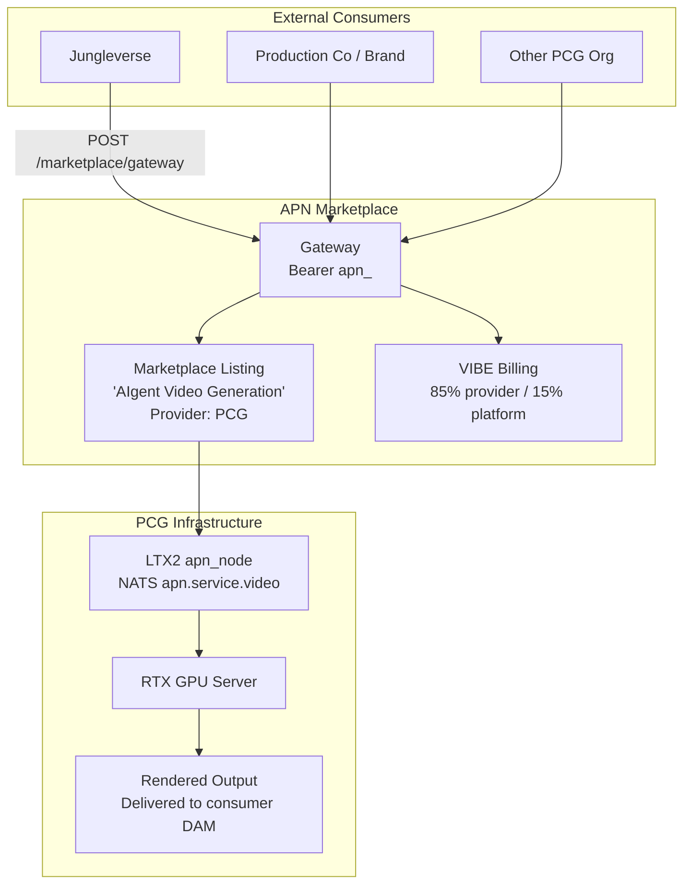
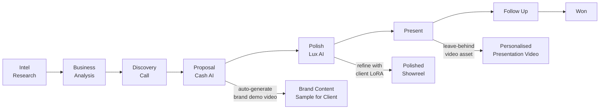

# AIgent Avatar & Content Generation Pipeline
**Status:** Proposal — For Team Review
**Date:** 2026-03-30
**Author:** PCG Platform Team

---

## Overview

This document outlines a proposed pipeline for generating branded video content and visual avatars for PCG's AIgents (Nora, Bodhi/Jessy, Josh, etc.) using open-source, locally-run AI video generation — eliminating subscription dependency while maintaining full IP ownership.

**Key insight from research:** The combination of LTX2 (open-weights video model by Lightricks) and a node-based prompt orchestration workflow makes it possible to turn a single agent identity definition into a full library of video content in one automated run — fully integrated into PCG's existing DAM, social publishing, and APN Marketplace infrastructure.

---

## Source Research

### Finding 1 — LTX2 (Open-Source Local Video Generation)
- Released by Lightricks as fully open-weights
- Runs locally on Nvidia RTX GPUs (optimized for RTX 4090)
- Native 4K resolution, 50 FPS, minimal VRAM usage
- Supports LoRA fine-tuning → trainable on agent visual identity
- Text-to-video AND image-to-video
- No subscription, no throttling, data never leaves your infrastructure
- **Currently the highest-benchmarking open-weights video model**

### Finding 2 — Node-Based Brand Content Workflow
- Static images (4) → 6 finished 3D brand videos in one run
- Architecture: define product/character/environment → node workflow → ChatGPT as camera instruction layer → rendered output
- Camera logic (angles, dollies, sweeps, movements) generated by an LLM, not manually keyframed
- Fully repeatable and automatable — not one-off prompting

---

## Strategic Fit with PCG Platform

---

## AIgent Avatar Identity System

Each AIgent needs a defined identity package before video generation can run. This maps cleanly onto the existing knowledge graph schema.

---

## Full Content Generation Pipeline

---

## APN Marketplace Integration

LTX2 can be registered as an `apn_node` service on the APN Marketplace — making it available to external clients (production companies, brands, other orgs) as a VIBE-billed API.

**Revenue model:** Clients pay in VIBE per generation run. No Runway/Sora subscriptions. PCG keeps 15% platform fee on every external job run through the marketplace.

---

## Dealflow Pipeline Connection

The content generation pipeline creates a compelling **demo asset** for each stage of the dealflow:

At the **Proposal stage**, Nora (Cash AI) could auto-trigger a demo video generation run using the client's brand intel from the knowledge graph — giving the pitch a live deliverable before the meeting.

---

## Infrastructure Requirements

| Component | Status | Notes |
|---|---|---|
| LTX2 model weights | To acquire | Open weights, free download |
| RTX GPU node | To confirm | RTX 4090 optimal; RTX 3090 viable |
| ComfyUI / node runtime | To install | Standard LTX2 inference environment |
| LoRA training pipeline | To build | One-time per agent identity |
| APN node registration | Ready | Existing marketplace infra |
| DAM integration | Ready | `POST /api/projects/:id/media` already exists |
| Social publishing | Ready | Automation 6 already in place |
| Scene orchestrator prompt | To build | Nora system instruction extension |

---

## Implementation Phases

### Phase 1 — Foundation (Week 1-2)
- [ ] Set up LTX2 locally, confirm GPU node
- [ ] Define Agent Identity Package schema (extend knowledge graph)
- [ ] Create LoRA training pipeline for Nora visual identity
- [ ] Build scene orchestration system instruction (Nora-driven)
- [ ] Manual test: Nora static images → 6 videos

### Phase 2 — Platform Integration (Week 3-4)
- [ ] Wire video output → DAM (`media_type = 'aigent_video'`)
- [ ] Register LTX2 as `apn_node` on APN Marketplace
- [ ] Build `POST /api/agents/:id/generate-content` route
- [ ] Admin UI: "Generate Content Batch" button on agent profile
- [ ] Social scheduling integration for generated batches

### Phase 3 — Dealflow Automation (Week 5-6)
- [ ] Auto-trigger video demo on Proposal stage entry (Cash AI hook)
- [ ] Client brand LoRA generation from brand intel pipeline
- [ ] Personalized pitch video generation per prospect
- [ ] Deliverable auto-registration in knowledge graph on completion

### Phase 4 — Marketplace (Week 7-8)
- [ ] External API documentation for `apn.service.video`
- [ ] VIBE pricing model finalization
- [ ] Onboard first external consumer (Jungleverse)
- [ ] Analytics: generation jobs, VIBE earned, content performance

---

## Key Benefits Summary

| Benefit | Detail |
|---|---|
| **No subscription costs** | LTX2 is open-weights — zero per-generation fees |
| **IP ownership** | All renders happen on PCG infra — client brand assets never leave |
| **Repeatable at scale** | Node workflow = same quality every run, not one-off prompting |
| **Agent personality-driven** | Nora orchestrates scene logic — content is on-brand by design |
| **Revenue stream** | APN Marketplace exposes this as a VIBE-billed service to external clients |
| **Dealflow accelerator** | Auto-generates demo assets during proposal/polish stages |
| **LoRA consistency** | Fine-tuned per agent = consistent visual identity across all content |

---

## Open Questions for Team

1. **GPU availability** — Do we have an RTX node available, or do we need to acquire/rent one? This determines if this is platform-native or an APN marketplace node.
2. **Agent visual identity** — Have character/appearance designs been defined for Nora and other AIgents? LoRA training needs a reference image set.
3. **Content use cases priority** — Social content, client pitch videos, or internal demos first?
4. **LoRA training data** — Who owns/creates the source imagery for each AIgent's visual identity?
5. **Marketplace pricing** — What VIBE rate per generation run makes sense given compute cost?

---

*Document based on research from LTX2 by Lightricks and node-based brand workflow demonstrations (March 2026).*
