# Integrations Developer Role — Master Plan

**Version**: 1.0  
**Date**: 2026-04-21  
**Owner**: Integrations Dev (TBH)  
**Status**: Planning — Not Started  
**Scope**: All external service integrations across the ORCHA dashboard

> This document defines the full scope, architecture, and priority-ordered work plan for the
> integrations developer role. It covers Social Publishing, Cloud Storage, Email, Financial,
> Calendar, Payments, and AI Model integrations. Timelines are intentionally omitted — progress
> is gated by completion quality, not calendar dates.

---

## Table of Contents

1. [Role Overview](#role-overview)
2. [Integration Architecture](#integration-architecture)
3. [Shared Infrastructure (Build First)](#shared-infrastructure-build-first)
4. [Priority 1 — Social Publishing Pipeline](#priority-1--social-publishing-pipeline)
5. [Priority 2 — Cloud Storage Sync](#priority-2--cloud-storage-sync)
6. [Priority 3 — Email Integration](#priority-3--email-integration)
7. [Priority 4 — QuickBooks Financial Sync](#priority-4--quickbooks-financial-sync)
8. [Priority 5 — Calendar & Scheduling](#priority-5--calendar--scheduling)
9. [Priority 6 — Stripe Billing](#priority-6--stripe-billing)
10. [Priority 7 — Team Communication (Slack + Discord)](#priority-7--team-communication-slack--discord)
11. [Priority 8 — GitHub Repository Sync](#priority-8--github-repository-sync)
12. [Priority 9 — Extended Social Platforms](#priority-9--extended-social-platforms)
13. [Dashboard Integration Layer](#dashboard-integration-layer)
14. [Workflow Node Types](#workflow-node-types)
15. [Current State Reference](#current-state-reference)

---

## Role Overview

The integrations developer owns the **active connectivity layer** between ORCHA and every external
service. This means OAuth flows, background sync jobs, webhook receivers, platform API calls, and
the frontend settings + dashboard surfaces that make those connections visible and actionable.

Every integration follows the same lifecycle:

```
Connect (OAuth) → Store Credentials → Background Sync → Normalize to ORCHA schema →
Surface in Dashboard → Expose as Workflow Node → Enable Nora Voice Queries
```

The integrations dev does **not** own the workflow engine, the AI agent layer, or the CRM data
model — but every integration must feed into all three.

---

## Integration Architecture

The diagram below shows how external services connect to ORCHA's internal data layer.

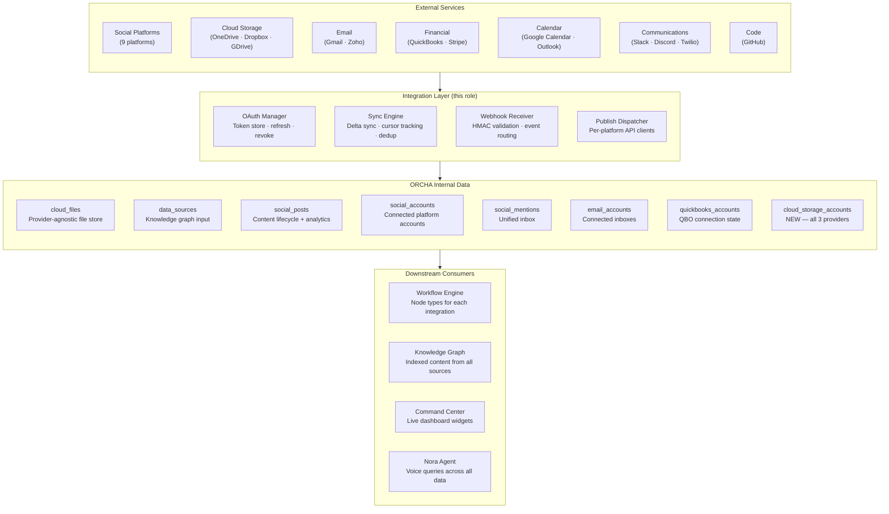
```mermaid
graph TB
    subgraph External["External Services"]
        direction TB
        SOC["Social Platforms\n(9 platforms)"]
        CLD["Cloud Storage\n(OneDrive · Dropbox · GDrive)"]
        EML["Email\n(Gmail · Zoho)"]
        FIN["Financial\n(QuickBooks · Stripe)"]
        CAL["Calendar\n(Google Calendar · Outlook)"]
        COM["Communications\n(Slack · Discord · Twilio)"]
        GIT["Code\n(GitHub)"]
    end

    subgraph ConnLayer["Integration Layer (this role)"]
        direction TB
        OAUTH["OAuth Manager\nToken store · refresh · revoke"]
        SYNC["Sync Engine\nDelta sync · cursor tracking · dedup"]
        WEBHOOK["Webhook Receiver\nHMAC validation · event routing"]
        PUBLISH["Publish Dispatcher\nPer-platform API clients"]
    end

    subgraph Internal["ORCHA Internal Data"]
        direction TB
        CF["cloud_files\nProvider-agnostic file store"]
        DS["data_sources\nKnowledge graph input"]
        SP["social_posts\nContent lifecycle + analytics"]
        SA["social_accounts\nConnected platform accounts"]
        SM["social_mentions\nUnified inbox"]
        EA["email_accounts\nConnected inboxes"]
        QBA["quickbooks_accounts\nQBO connection state"]
        CS["cloud_storage_accounts\nNEW — all 3 providers"]
    end

    subgraph Consumers["Downstream Consumers"]
        WF["Workflow Engine\nNode types for each integration"]
        KG["Knowledge Graph\nIndexed content from all sources"]
        CC["Command Center\nLive dashboard widgets"]
        NORA["Nora Agent\nVoice queries across all data"]
    end

    External --> ConnLayer
    ConnLayer --> Internal
    Internal --> Consumers
```

---

## Shared Infrastructure (Build First)

Before writing any platform-specific code, build these shared primitives once. Every integration
uses them.

### OAuth Token Manager

A single place to store, refresh, and revoke tokens for all OAuth providers. All current
integrations store tokens ad-hoc in their own tables. This consolidates the pattern.

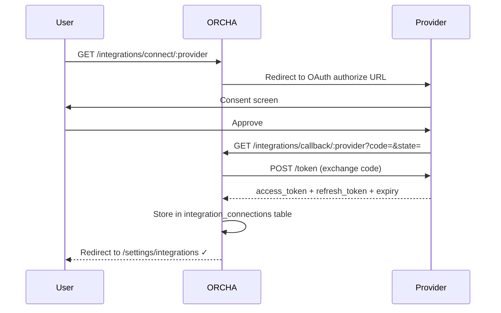
```mermaid
sequenceDiagram
    participant User
    participant ORCHA
    participant Provider

    User->>ORCHA: GET /integrations/connect/:provider
    ORCHA->>Provider: Redirect to OAuth authorize URL
    Provider->>User: Consent screen
    User->>Provider: Approve
    Provider->>ORCHA: GET /integrations/callback/:provider?code=&state=
    ORCHA->>Provider: POST /token (exchange code)
    Provider-->>ORCHA: access_token + refresh_token + expiry
    ORCHA->>ORCHA: Store in integration_connections table
    ORCHA-->>User: Redirect to /settings/integrations ✓
```

**New table: `integration_connections`**

```sql
CREATE TABLE integration_connections (
    id              BLOB PRIMARY KEY,
    organization_id BLOB NOT NULL REFERENCES organizations(id),
    project_id      BLOB REFERENCES projects(id),       -- NULL = org-level
    provider        TEXT NOT NULL,                       -- 'twitter', 'onedrive', 'gmail', etc.
    provider_account_id TEXT NOT NULL,
    display_name    TEXT,
    avatar_url      TEXT,
    access_token    TEXT,
    refresh_token   TEXT,
    token_expires_at TEXT,
    scopes          TEXT,                                -- JSON array
    status          TEXT NOT NULL DEFAULT 'active',      -- active/expired/error/disconnected
    last_sync_at    TEXT,
    last_error      TEXT,
    metadata        TEXT NOT NULL DEFAULT '{}',          -- provider-specific extras
    created_at      TEXT NOT NULL DEFAULT (datetime('now','subsec')),
    updated_at      TEXT NOT NULL DEFAULT (datetime('now','subsec')),
    UNIQUE(organization_id, provider, provider_account_id)
);
```

> **Note**: Existing `social_accounts`, `email_accounts`, `quickbooks_accounts`,
> `dropbox_sources` tables remain — they hold provider-specific data. `integration_connections`
> is the OAuth credential store only. Sync state lives in the provider tables.

### Token Refresh Worker

Runs on a 15-minute interval alongside existing automation loops. Finds all tokens expiring
within 1 hour and refreshes them proactively.

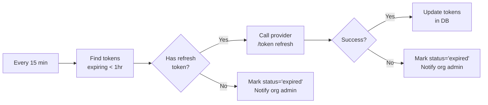
```mermaid
flowchart LR
    A["Every 15 min"] --> B["Find tokens\nexpiring < 1hr"]
    B --> C{Has refresh\ntoken?}
    C -- Yes --> D["Call provider\n/token refresh"]
    D --> E{Success?}
    E -- Yes --> F["Update tokens\nin DB"]
    E -- No --> G["Mark status='expired'\nNotify org admin"]
    C -- No --> H["Mark status='expired'\nNotify org admin"]
```

### Sync Loop Architecture

All three cloud storage providers and social analytics use the same loop pattern, already proven
in `spawn_workflow_schedule_loop()`.

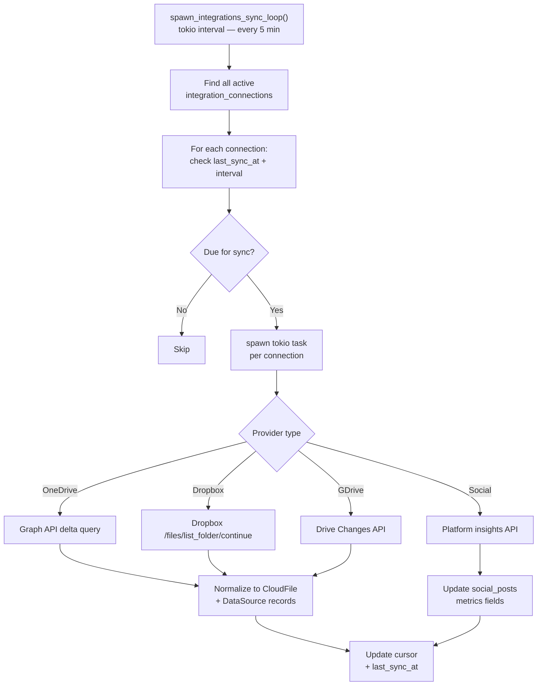
```mermaid
flowchart TD
    A["spawn_integrations_sync_loop()\ntokio interval — every 5 min"] --> B["Find all active\nintegration_connections"]
    B --> C["For each connection:\ncheck last_sync_at + interval"]
    C --> D{Due for sync?}
    D -- No --> E["Skip"]
    D -- Yes --> F["spawn tokio task\nper connection"]
    F --> G{Provider type}
    G -- OneDrive --> H["Graph API delta query"]
    G -- Dropbox --> I["Dropbox /files/list_folder/continue"]
    G -- GDrive --> J["Drive Changes API"]
    G -- Social --> K["Platform insights API"]
    H & I & J --> L["Normalize to CloudFile\n+ DataSource records"]
    K --> M["Update social_posts\nmetrics fields"]
    L --> N["Update cursor\n+ last_sync_at"]
    M --> N
```

---

## Priority 1 — Social Publishing Pipeline

**Why first**: Stage 0 exit criterion is "PCG runs 100% of social media management through
ORCHA." Currently the data model is complete and sophisticated but **no post has ever been
published via ORCHA** — the publish layer does not exist.

### Current State

| Component | Status |
|-----------|--------|
| `SocialPlatform` enum (9 platforms) | ✅ Complete |
| `SocialPost` model (full lifecycle + analytics) | ✅ Complete |
| `SocialMention` model (unified inbox) | ✅ Complete |
| `find_due_for_publish()` DB method | ✅ Complete |
| `mark_published()` / `mark_failed()` | ✅ Complete |
| `update_metrics()` | ✅ Complete |
| Best-times algorithm (engagement-based) | ✅ Complete |
| OAuth connect flows | ❌ Missing |
| Platform API publish implementations | ❌ Missing |
| Publish automation loop | ❌ Missing (planned in memory, never written) |
| Analytics sync job | ❌ Missing |
| Mention/DM sync job | ❌ Missing |
| Token refresh | ❌ Missing |

### P1-A: OAuth Connect Flows

Add `GET /social/connect/:platform` and `GET /social/callback/:platform` to
`social_accounts.rs`. Uses the shared OAuth Token Manager above.

**Priority platform order** (based on PCG agency use):

1. **LinkedIn** — B2B content, company pages, most critical for agency clients
2. **Instagram** — Meta Business API (shares app with Facebook)
3. **Twitter/X** — OAuth 2.0 PKCE, relatively straightforward
4. **TikTok** — Content Posting API (requires platform approval, start early)
5. **Facebook** — same Meta App as Instagram, incremental work once #2 done
6. **YouTube** — OAuth via Google (same app as Calendar/Drive), video uploads
7. **Threads** — Meta API (shares app with Instagram/Facebook)
8. **Bluesky** — AT Protocol (different from OAuth, uses app passwords)
9. **Pinterest** — OAuth 2.0, lower priority for agency work

### P1-B: Publish Automation Loop

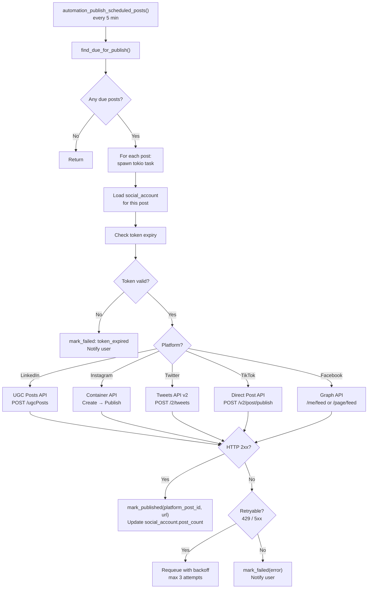
```mermaid
flowchart TD
    A["automation_publish_scheduled_posts()\nevery 5 min"] --> B["find_due_for_publish()"]
    B --> C{Any due posts?}
    C -- No --> Z["Return"]
    C -- Yes --> D["For each post:\nspawn tokio task"]
    D --> E["Load social_account\nfor this post"]
    E --> F["Check token expiry"]
    F --> G{Token valid?}
    G -- No --> H["mark_failed: token_expired\nNotify user"]
    G -- Yes --> I{Platform?}
    I -- LinkedIn --> J["UGC Posts API\nPOST /ugcPosts"]
    I -- Instagram --> K["Container API\nCreate → Publish"]
    I -- Twitter --> L["Tweets API v2\nPOST /2/tweets"]
    I -- TikTok --> M["Direct Post API\nPOST /v2/post/publish"]
    I -- Facebook --> N["Graph API\n/me/feed or /page/feed"]
    J & K & L & M & N --> O{HTTP 2xx?}
    O -- Yes --> P["mark_published(platform_post_id, url)\nUpdate social_account.post_count"]
    O -- No --> Q{Retryable?\n429 / 5xx}
    Q -- Yes --> R["Requeue with backoff\nmax 3 attempts"]
    Q -- No --> S["mark_failed(error)\nNotify user"]
```

**Also add**: `POST /social/posts/:id/publish` — manual immediate publish, bypasses scheduler.

### P1-C: Platform-Specific Publish Notes

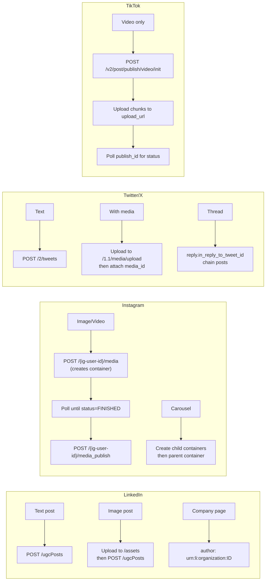
```mermaid
graph LR
    subgraph LinkedIn
        L1["Text post"] --> L2["POST /ugcPosts"]
        L3["Image post"] --> L4["Upload to /assets\nthen POST /ugcPosts"]
        L5["Company page"] --> L6["author: urn:li:organization:ID"]
    end

    subgraph Instagram
        I1["Image/Video"] --> I2["POST /{ig-user-id}/media\n(creates container)"]
        I2 --> I3["Poll until status=FINISHED"]
        I3 --> I4["POST /{ig-user-id}/media_publish"]
        I5["Carousel"] --> I6["Create child containers\nthen parent container"]
    end

    subgraph "Twitter/X"
        T1["Text"] --> T2["POST /2/tweets"]
        T3["With media"] --> T4["Upload to /1.1/media/upload\nthen attach media_id"]
        T5["Thread"] --> T6["reply.in_reply_to_tweet_id\nchain posts"]
    end

    subgraph TikTok
        TK1["Video only"] --> TK2["POST /v2/post/publish/video/init"]
        TK2 --> TK3["Upload chunks to upload_url"]
        TK3 --> TK4["Poll publish_id for status"]
    end
```

### P1-D: Analytics Sync

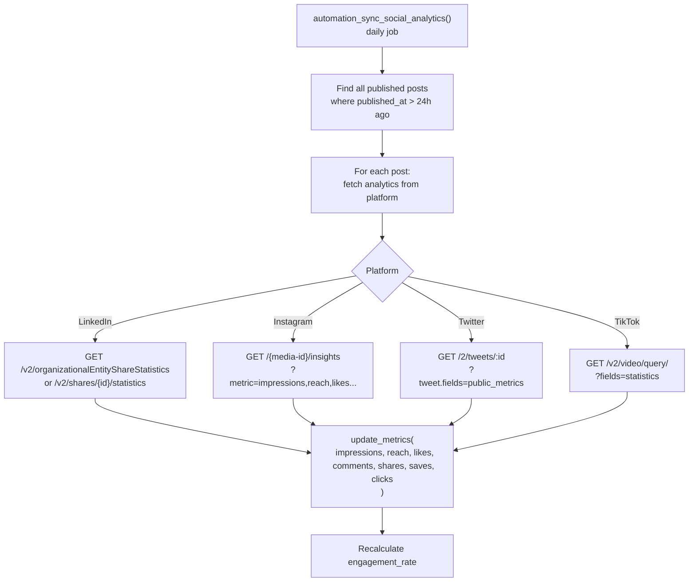
```mermaid
flowchart TD
    A["automation_sync_social_analytics()\ndaily job"] --> B["Find all published posts\nwhere published_at > 24h ago"]
    B --> C["For each post:\nfetch analytics from platform"]
    C --> D{Platform}
    D -- LinkedIn --> E["GET /v2/organizationalEntityShareStatistics\nor /v2/shares/{id}/statistics"]
    D -- Instagram --> F["GET /{media-id}/insights\n?metric=impressions,reach,likes..."]
    D -- Twitter --> G["GET /2/tweets/:id\n?tweet.fields=public_metrics"]
    D -- TikTok --> H["GET /v2/video/query/\n?fields=statistics"]
    E & F & G & H --> I["update_metrics(\n  impressions, reach, likes,\n  comments, shares, saves, clicks\n)"]
    I --> J["Recalculate engagement_rate"]
```

### P1-E: Unified Inbox Sync

Pull mentions, comments, and DMs into `social_mentions` for the unified inbox.

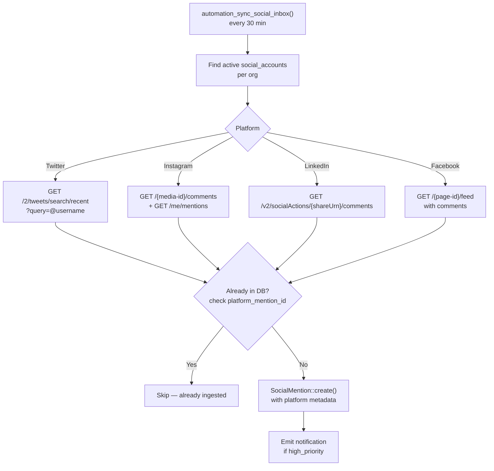
```mermaid
flowchart TD
    A["automation_sync_social_inbox()\nevery 30 min"] --> B["Find active social_accounts\nper org"]
    B --> C{Platform}
    C -- Twitter --> D["GET /2/tweets/search/recent\n?query=@username"]
    C -- Instagram --> E["GET /{media-id}/comments\n+ GET /me/mentions"]
    C -- LinkedIn --> F["GET /v2/socialActions/{shareUrn}/comments"]
    C -- Facebook --> G["GET /{page-id}/feed\nwith comments"]
    D & E & F & G --> H{Already in DB?\ncheck platform_mention_id}
    H -- Yes --> I["Skip — already ingested"]
    H -- No --> J["SocialMention::create()\nwith platform metadata"]
    J --> K["Emit notification\nif high_priority"]
```

---

## Priority 2 — Cloud Storage Sync

**Why second**: PCG actively uses OneDrive. Every file in OneDrive is a potential knowledge
graph source, media library item, or deliverable. Without this, agents cannot see or work with
PCG's actual content library.

### Current State

| Component | Status |
|-----------|--------|
| `dropbox_source.rs` model (cursor sync, auto_ingest) | ✅ Exists |
| `cloud_file.rs` model (provider-agnostic destination) | ✅ Exists |
| `data_source.rs` model (knowledge graph input) | ✅ Exists |
| Dropbox routes (list/create/delete only) | ⚠️ Stub |
| Dropbox OAuth | ❌ Missing |
| Dropbox file sync | ❌ Missing |
| Google Drive model | ❌ Missing |
| Google Drive OAuth + sync | ❌ Missing |
| OneDrive model | ❌ Missing |
| OneDrive OAuth + sync | ❌ Missing |
| Unified cloud storage settings page | ❌ Missing |

### Architecture: Three Providers, One Destination

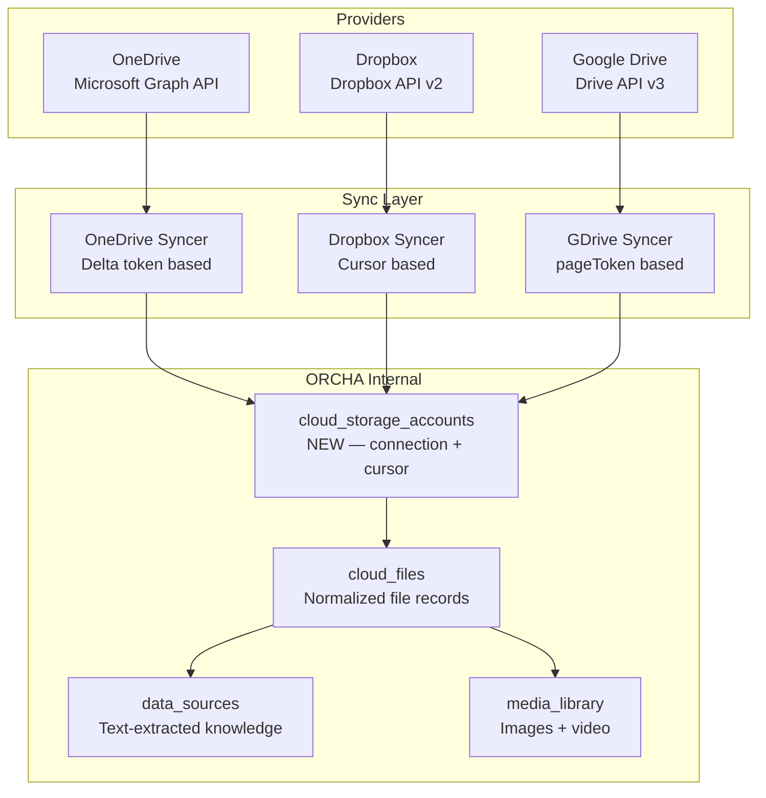
```mermaid
graph TD
    subgraph Providers
        OD["OneDrive\nMicrosoft Graph API"]
        DB["Dropbox\nDropbox API v2"]
        GD["Google Drive\nDrive API v3"]
    end

    subgraph ConnLayer["Sync Layer"]
        ODS["OneDrive Syncer\nDelta token based"]
        DBS["Dropbox Syncer\nCursor based"]
        GDS["GDrive Syncer\npageToken based"]
    end

    subgraph Destination["ORCHA Internal"]
        CS["cloud_storage_accounts\nNEW — connection + cursor"]
        CF["cloud_files\nNormalized file records"]
        DS["data_sources\nText-extracted knowledge"]
        ML["media_library\nImages + video"]
    end

    OD --> ODS --> CS
    DB --> DBS --> CS
    GD --> GDS --> CS
    CS --> CF
    CF --> DS
    CF --> ML
```

### New Table: `cloud_storage_accounts`

Replaces the provider-specific `dropbox_sources` approach with a unified connector table.
Existing `dropbox_sources` rows can migrate forward.

```sql
CREATE TABLE cloud_storage_accounts (
    id              BLOB PRIMARY KEY,
    organization_id BLOB NOT NULL REFERENCES organizations(id),
    project_id      BLOB REFERENCES projects(id),
    provider        TEXT NOT NULL,          -- 'onedrive' | 'dropbox' | 'gdrive'
    account_email   TEXT,
    display_name    TEXT,
    access_token    TEXT,
    refresh_token   TEXT,
    token_expires_at TEXT,
    sync_cursor     TEXT,                   -- delta token / page token / cursor
    sync_root_path  TEXT,                   -- which folder to sync (NULL = root)
    auto_sync       INTEGER NOT NULL DEFAULT 1,
    sync_interval_secs INTEGER NOT NULL DEFAULT 900,  -- 15 min default
    last_sync_at    TEXT,
    last_error      TEXT,
    status          TEXT NOT NULL DEFAULT 'active',
    total_files_synced INTEGER NOT NULL DEFAULT 0,
    created_at      TEXT NOT NULL DEFAULT (datetime('now','subsec')),
    updated_at      TEXT NOT NULL DEFAULT (datetime('now','subsec'))
);
```

### P2-A: OneDrive (Build First — PCG Uses It)

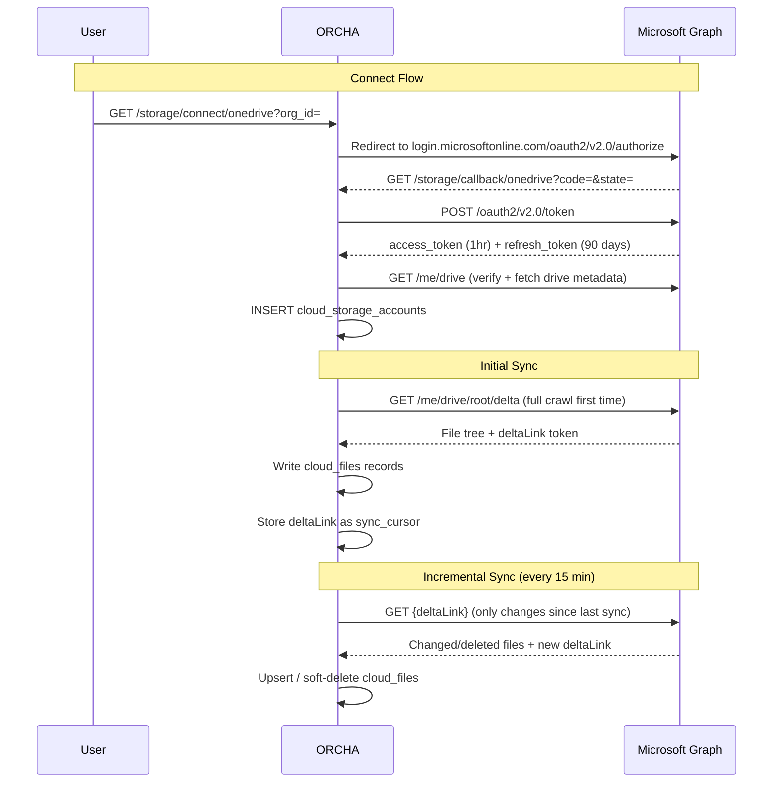
```mermaid
sequenceDiagram
    participant User
    participant ORCHA
    participant MsGraph as Microsoft Graph

    Note over User,MsGraph: Connect Flow
    User->>ORCHA: GET /storage/connect/onedrive?org_id=
    ORCHA->>MsGraph: Redirect to login.microsoftonline.com/oauth2/v2.0/authorize
    MsGraph-->>ORCHA: GET /storage/callback/onedrive?code=&state=
    ORCHA->>MsGraph: POST /oauth2/v2.0/token
    MsGraph-->>ORCHA: access_token (1hr) + refresh_token (90 days)
    ORCHA->>MsGraph: GET /me/drive (verify + fetch drive metadata)
    ORCHA->>ORCHA: INSERT cloud_storage_accounts

    Note over ORCHA,MsGraph: Initial Sync
    ORCHA->>MsGraph: GET /me/drive/root/delta (full crawl first time)
    MsGraph-->>ORCHA: File tree + deltaLink token
    ORCHA->>ORCHA: Write cloud_files records
    ORCHA->>ORCHA: Store deltaLink as sync_cursor

    Note over ORCHA,MsGraph: Incremental Sync (every 15 min)
    ORCHA->>MsGraph: GET {deltaLink} (only changes since last sync)
    MsGraph-->>ORCHA: Changed/deleted files + new deltaLink
    ORCHA->>ORCHA: Upsert / soft-delete cloud_files
```

**OneDrive-specific considerations**:
- Required scopes: `Files.Read.All`, `offline_access`, `User.Read`
- Delta query returns `@odata.deltaLink` — store this as `sync_cursor`
- File content extraction: download via `GET /me/drive/items/{id}/content` then extract text
- Shared drives (SharePoint): `GET /me/drive/sharedWithMe` for org-shared files
- Large files: use `GET /me/drive/items/{id}/content` with Range headers

### P2-B: Dropbox (Finish What's Started)

The `dropbox_sources` model already has `cursor` and `mark_processed()`. Wire up OAuth and sync.

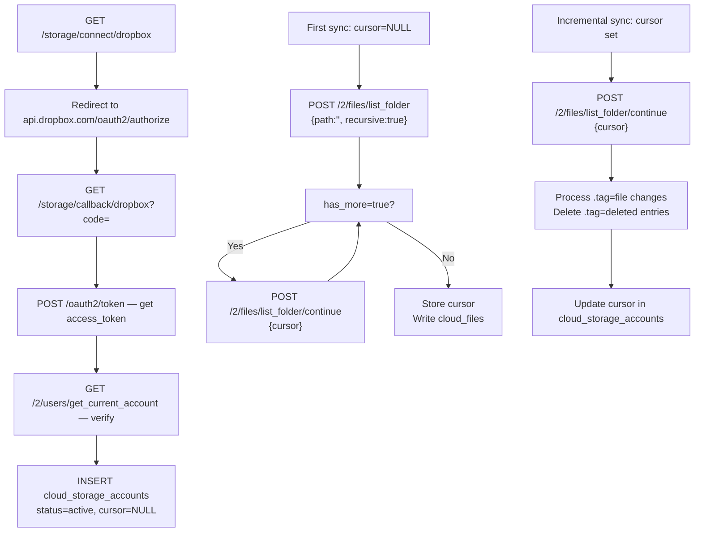
```mermaid
flowchart TD
    A["GET /storage/connect/dropbox"] --> B["Redirect to api.dropbox.com/oauth2/authorize"]
    B --> C["GET /storage/callback/dropbox?code="]
    C --> D["POST /oauth2/token — get access_token"]
    D --> E["GET /2/users/get_current_account — verify"]
    E --> F["INSERT cloud_storage_accounts\nstatus=active, cursor=NULL"]

    G["First sync: cursor=NULL"] --> H["POST /2/files/list_folder\n{path:'', recursive:true}"]
    H --> I["has_more=true?"]
    I -- Yes --> J["POST /2/files/list_folder/continue\n{cursor}"]
    J --> I
    I -- No --> K["Store cursor\nWrite cloud_files"]

    L["Incremental sync: cursor set"] --> M["POST /2/files/list_folder/continue\n{cursor}"]
    M --> N["Process .tag=file changes\nDelete .tag=deleted entries"]
    N --> O["Update cursor in cloud_storage_accounts"]
```

### P2-C: Google Drive

Shares the Google OAuth app with Gmail and Google Calendar — set up once, reuse scopes.

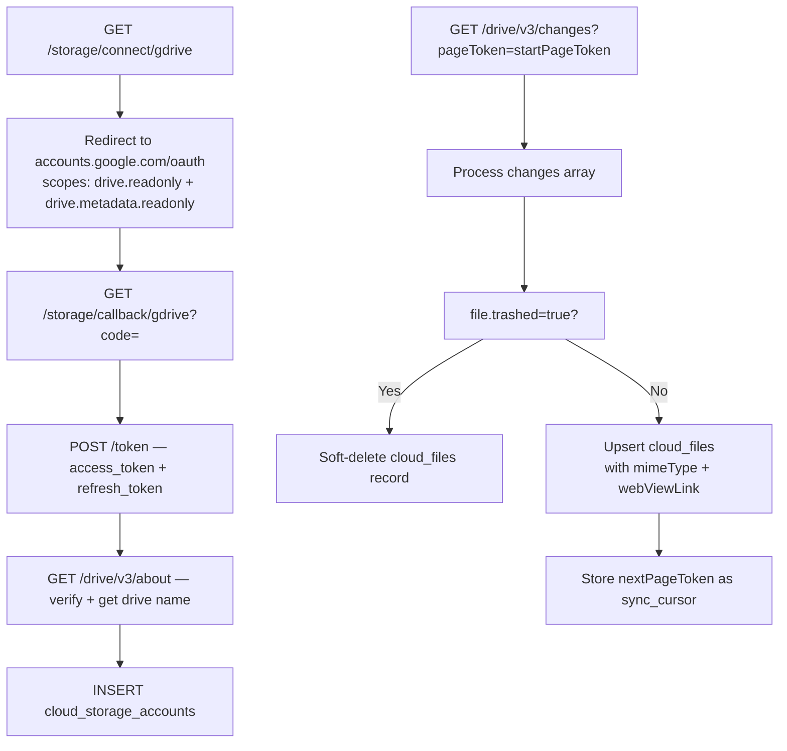
```mermaid
flowchart TD
    A["GET /storage/connect/gdrive"] --> B["Redirect to accounts.google.com/oauth\nscopes: drive.readonly + drive.metadata.readonly"]
    B --> C["GET /storage/callback/gdrive?code="]
    C --> D["POST /token — access_token + refresh_token"]
    D --> E["GET /drive/v3/about — verify + get drive name"]
    E --> F["INSERT cloud_storage_accounts"]

    G["GET /drive/v3/changes?pageToken=startPageToken"] --> H["Process changes array"]
    H --> I["file.trashed=true?"]
    I -- Yes --> J["Soft-delete cloud_files record"]
    I -- No --> K["Upsert cloud_files\nwith mimeType + webViewLink"]
    K --> L["Store nextPageToken as sync_cursor"]
```

### P2-D: Content Extraction Pipeline

Once files are in `cloud_files`, text-extractable files feed the knowledge graph.

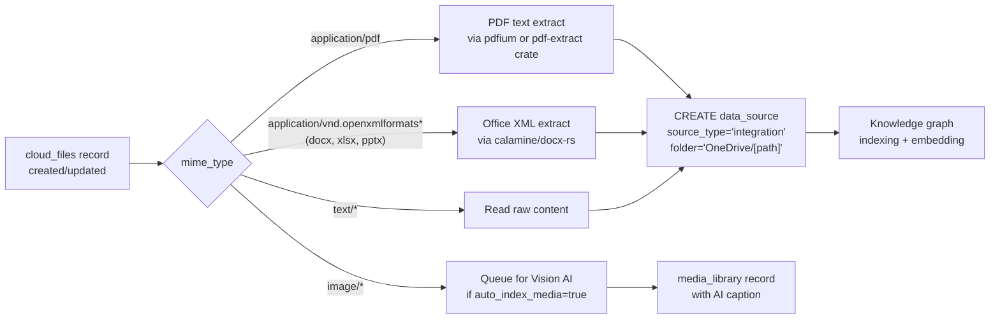
```mermaid
flowchart LR
    CF["cloud_files record\ncreated/updated"] --> E{mime_type}
    E -- "application/pdf" --> PDF["PDF text extract\nvia pdfium or pdf-extract crate"]
    E -- "application/vnd.openxmlformats*\n(docx, xlsx, pptx)" --> OFFICE["Office XML extract\nvia calamine/docx-rs"]
    E -- "text/*" --> TXT["Read raw content"]
    E -- "image/*" --> IMG["Queue for Vision AI\nif auto_index_media=true"]
    PDF & OFFICE & TXT --> DS["CREATE data_source\nsource_type='integration'\nfolder='OneDrive/[path]'"]
    DS --> KG["Knowledge graph\nindexing + embedding"]
    IMG --> ML["media_library record\nwith AI caption"]
```

---

## Priority 3 — Email Integration

**Why third**: The email intake pipeline already partially exists but the sync backbone is a
TODO. Gmail integration unlocks Nora reading emails, auto-task creation from action items, and
the trusted-sender intake workflow documented in memory.

### Current State

| Component | Status |
|-----------|--------|
| `email_accounts.rs` (610 lines) — Gmail + Zoho OAuth scaffold | ⚠️ OAuth exists, sync TODO |
| `email_messages.rs` (160 lines) — CRUD routes | ⚠️ CRUD only, no live sync |
| Trusted sender intake pipeline | ✅ Exists (`POST /api/call-intake/email`) |
| Gmail send | ❌ Missing |
| IMAP/Gmail API pull | ❌ Missing |
| Attachment handling | ❌ Missing |
| Email → task creation | ⚠️ Logic exists, trigger missing |

### Email Sync Architecture

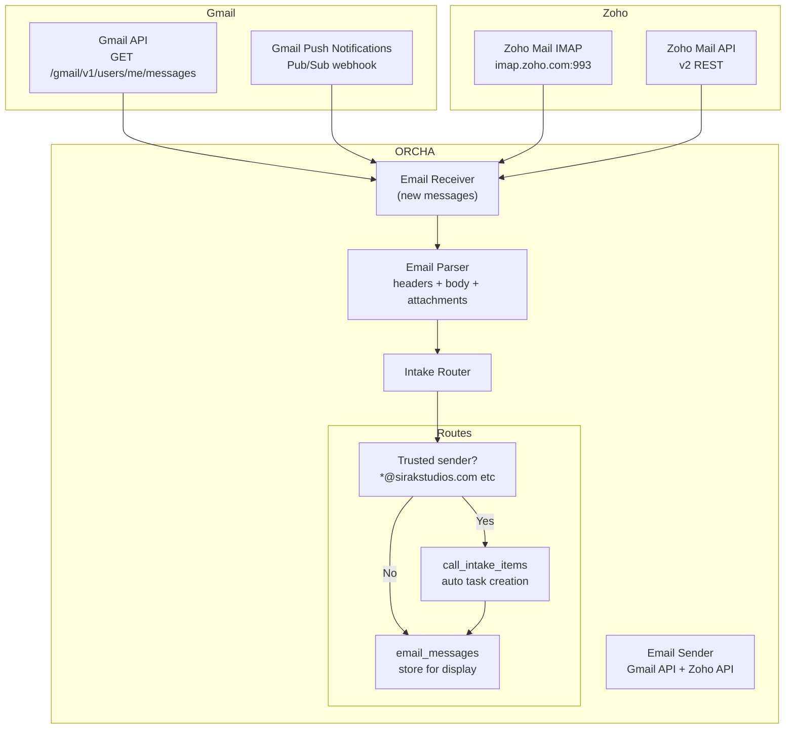
```mermaid
flowchart TD
    subgraph Gmail
        GAPI["Gmail API\nGET /gmail/v1/users/me/messages"]
        GPUSH["Gmail Push Notifications\nPub/Sub webhook"]
    end

    subgraph Zoho
        ZIMAP["Zoho Mail IMAP\nimap.zoho.com:993"]
        ZAPI["Zoho Mail API\nv2 REST"]
    end

    subgraph ORCHA
        RECV["Email Receiver\n(new messages)"]
        PARSE["Email Parser\nheaders + body + attachments"]
        ROUTE["Intake Router"]

        subgraph Routes
            TRUST["Trusted sender?\n*@sirakstudios.com etc"]
            INTAKE["call_intake_items\nauto task creation"]
            INBOX["email_messages\nstore for display"]
        end

        SEND["Email Sender\nGmail API + Zoho API"]
    end

    GAPI --> RECV
    GPUSH --> RECV
    ZIMAP --> RECV
    ZAPI --> RECV
    RECV --> PARSE
    PARSE --> ROUTE
    ROUTE --> TRUST
    TRUST -- Yes --> INTAKE
    TRUST -- No --> INBOX
    INTAKE --> INBOX
```

### P3-A: Gmail Sync (Finish the TODO)

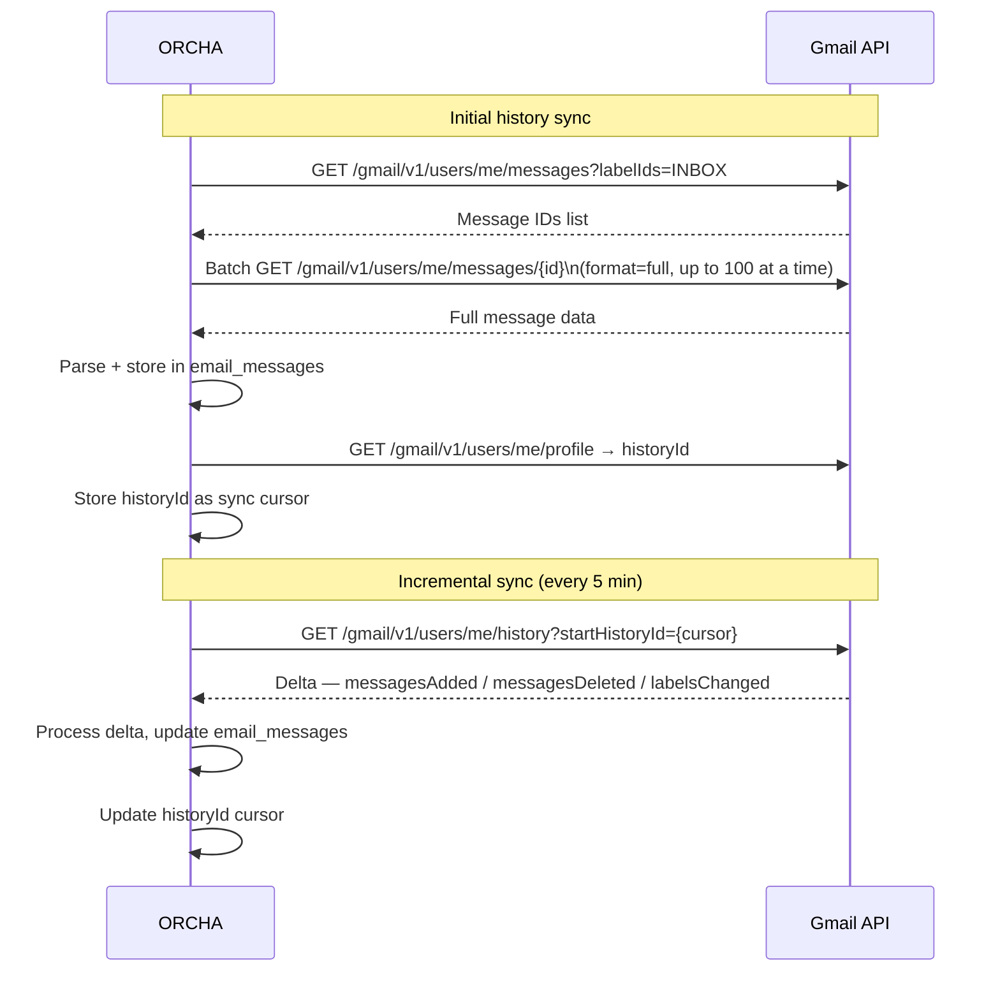
```mermaid
sequenceDiagram
    participant ORCHA
    participant Gmail as Gmail API

    Note over ORCHA,Gmail: Initial history sync
    ORCHA->>Gmail: GET /gmail/v1/users/me/messages?labelIds=INBOX
    Gmail-->>ORCHA: Message IDs list
    ORCHA->>Gmail: Batch GET /gmail/v1/users/me/messages/{id}\n(format=full, up to 100 at a time)
    Gmail-->>ORCHA: Full message data
    ORCHA->>ORCHA: Parse + store in email_messages
    ORCHA->>Gmail: GET /gmail/v1/users/me/profile → historyId
    ORCHA->>ORCHA: Store historyId as sync cursor

    Note over ORCHA,Gmail: Incremental sync (every 5 min)
    ORCHA->>Gmail: GET /gmail/v1/users/me/history?startHistoryId={cursor}
    Gmail-->>ORCHA: Delta — messagesAdded / messagesDeleted / labelsChanged
    ORCHA->>ORCHA: Process delta, update email_messages
    ORCHA->>ORCHA: Update historyId cursor
```

### P3-B: Email Send

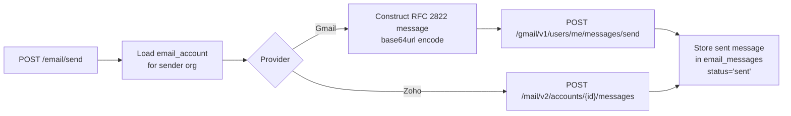
```mermaid
flowchart LR
    A["POST /email/send"] --> B["Load email_account\nfor sender org"]
    B --> C{Provider}
    C -- Gmail --> D["Construct RFC 2822 message\nbase64url encode"]
    D --> E["POST /gmail/v1/users/me/messages/send"]
    C -- Zoho --> F["POST /mail/v2/accounts/{id}/messages"]
    E & F --> G["Store sent message\nin email_messages\nstatus='sent'"]
```

### P3-C: Trusted Sender Intake (Complete the Wiring)

The logic in `organizations/intake.rs` parses action items from trusted-sender emails. The
missing piece is the trigger: when a new email arrives from a trusted sender, route to intake.

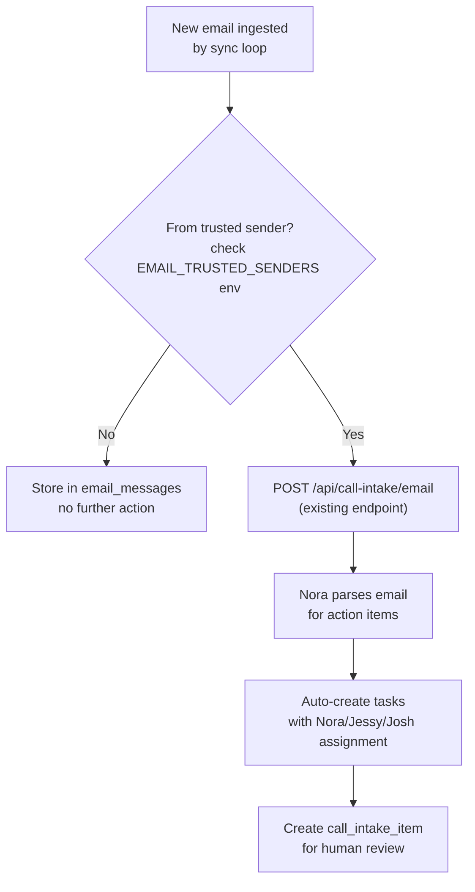
```mermaid
flowchart TD
    A["New email ingested\nby sync loop"] --> B{From trusted sender?\ncheck EMAIL_TRUSTED_SENDERS env}
    B -- No --> C["Store in email_messages\nno further action"]
    B -- Yes --> D["POST /api/call-intake/email\n(existing endpoint)"]
    D --> E["Nora parses email\nfor action items"]
    E --> F["Auto-create tasks\nwith Nora/Jessy/Josh assignment"]
    F --> G["Create call_intake_item\nfor human review"]
```

---

## Priority 4 — QuickBooks Financial Sync

**Why fourth**: OAuth and account management exist. The sync logic that turns QBO data into CRM
intelligence is a TODO. Once wired, Nora can answer "what's the AR balance for Acme?" and the
command center can show real financial data.

### Current State

| Component | Status |
|-----------|--------|
| OAuth 2.0 flow (connect/callback) | ✅ Complete |
| Account management (CRUD) | ✅ Complete |
| Token refresh + revoke | ✅ Complete |
| Sandbox/production environment switching | ✅ Complete |
| Entity mapping table (`quickbooks_entity_map`) | ✅ Complete |
| `trigger_sync` endpoint | ⚠️ Exists but sync logic is TODO |
| QBO → CRM contacts sync | ❌ Missing |
| QBO → invoices sync | ❌ Missing |
| ORCHA invoice → QBO push | ❌ Missing |
| AR/AP dashboard widget | ❌ Missing |

### Sync Architecture

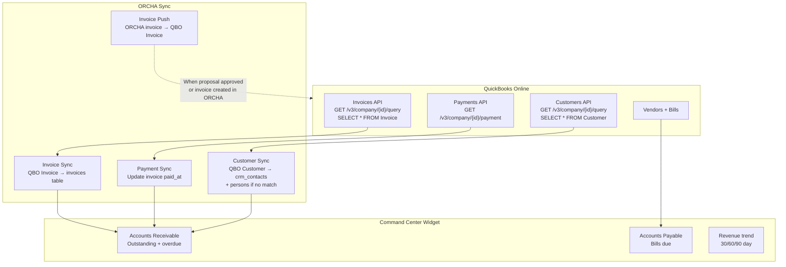
```mermaid
flowchart TD
    subgraph QBO["QuickBooks Online"]
        CUST["Customers API\nGET /v3/company/{id}/query\nSELECT * FROM Customer"]
        INV["Invoices API\nGET /v3/company/{id}/query\nSELECT * FROM Invoice"]
        PAY["Payments API\nGET /v3/company/{id}/payment"]
        VEND["Vendors + Bills"]
    end

    subgraph ORCHA["ORCHA Sync"]
        direction TB
        CSYNC["Customer Sync\nQBO Customer → crm_contacts\n+ persons if no match"]
        ISYNC["Invoice Sync\nQBO Invoice → invoices table"]
        PSYNC["Payment Sync\nUpdate invoice paid_at"]
        PUSH["Invoice Push\nORCHA invoice → QBO Invoice"]
    end

    subgraph Dashboard["Command Center Widget"]
        AR["Accounts Receivable\nOutstanding + overdue"]
        AP["Accounts Payable\nBills due"]
        REV["Revenue trend\n30/60/90 day"]
    end

    CUST --> CSYNC
    INV --> ISYNC
    PAY --> PSYNC
    ISYNC --> AR
    PSYNC --> AR
    VEND --> AP
    CSYNC --> AR

    PUSH -.->|"When proposal approved\nor invoice created in ORCHA"| QBO
```

### P4-A: Pull Sync Implementation

The `trigger_sync` endpoint exists but calls no real logic. Implement `run_qbo_sync()`:

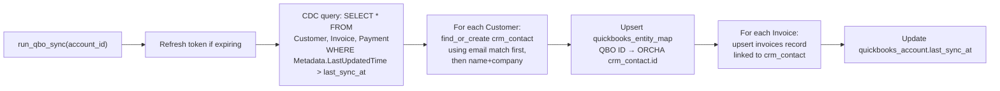
```mermaid
flowchart LR
    A["run_qbo_sync(account_id)"] --> B["Refresh token if expiring"]
    B --> C["CDC query: SELECT * FROM\nCustomer, Invoice, Payment\nWHERE Metadata.LastUpdatedTime > last_sync_at"]
    C --> D["For each Customer:\nfind_or_create crm_contact\nusing email match first,\nthen name+company"]
    D --> E["Upsert quickbooks_entity_map\nQBO ID → ORCHA crm_contact.id"]
    E --> F["For each Invoice:\nupsert invoices record\nlinked to crm_contact"]
    F --> G["Update quickbooks_account.last_sync_at"]
```

### P4-B: ORCHA → QBO Push

When an invoice is created in ORCHA and the org has a QBO connection, optionally push it to QBO.

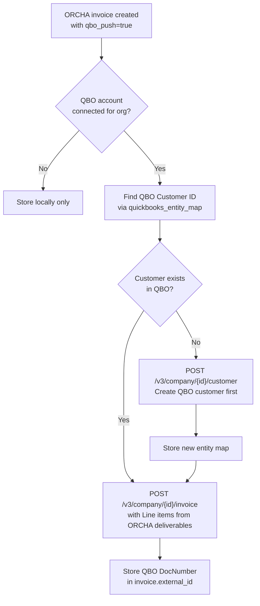
```mermaid
flowchart TD
    A["ORCHA invoice created\nwith qbo_push=true"] --> B{QBO account\nconnected for org?}
    B -- No --> C["Store locally only"]
    B -- Yes --> D["Find QBO Customer ID\nvia quickbooks_entity_map"]
    D --> E{Customer exists\nin QBO?}
    E -- No --> F["POST /v3/company/{id}/customer\nCreate QBO customer first"]
    F --> G["Store new entity map"]
    E -- Yes --> H["POST /v3/company/{id}/invoice\nwith Line items from ORCHA deliverables"]
    G --> H
    H --> I["Store QBO DocNumber\nin invoice.external_id"]
```

---

## Priority 5 — Calendar & Scheduling

**Why fifth**: Nora handles phone calls and meetings but has no visibility into the actual
calendar. Connecting Google Calendar and Outlook Calendar unlocks "what's on my schedule today",
auto-creating CRM activities from meetings, and scheduling proposals/follow-ups via voice.

### Architecture

```mermaid
graph TD
    subgraph Providers
        GC["Google Calendar\nCalendar API v3"]
        OC["Outlook Calendar\nMicrosoft Graph /calendars"]
    end

    subgraph ORCHA
        CSYNC["Calendar Sync\nDelta sync every 15 min"]
        EVENTS["events table\nNEW — normalized calendar events"]
        CRM["CRM Activities\nAuto-create from meetings"]
        NORA["Nora Context\nSchedule awareness"]
        MEET["meet.rs\n(existing meeting routes)"]
    end

    GC --> CSYNC
    OC --> CSYNC
    CSYNC --> EVENTS
    EVENTS --> CRM
    EVENTS --> NORA
    EVENTS --> MEET
```

### New Table: `calendar_events`

```sql
CREATE TABLE calendar_events (
    id                  BLOB PRIMARY KEY,
    organization_id     BLOB NOT NULL REFERENCES organizations(id),
    calendar_account_id BLOB NOT NULL,     -- integration_connections.id
    external_event_id   TEXT NOT NULL,
    title               TEXT NOT NULL,
    description         TEXT,
    start_at            TEXT NOT NULL,
    end_at              TEXT NOT NULL,
    location            TEXT,
    attendees           TEXT NOT NULL DEFAULT '[]',   -- JSON [{email, name, status}]
    organizer_email     TEXT,
    meeting_url         TEXT,              -- Zoom/Meet/Teams link extracted
    status              TEXT NOT NULL DEFAULT 'confirmed',
    crm_activity_id     BLOB REFERENCES crm_activities(id),
    crm_contact_ids     TEXT NOT NULL DEFAULT '[]',  -- JSON — matched attendees
    created_at          TEXT NOT NULL DEFAULT (datetime('now','subsec')),
    updated_at          TEXT NOT NULL DEFAULT (datetime('now','subsec')),
    UNIQUE(calendar_account_id, external_event_id)
);
```

### Calendar Sync + CRM Auto-Link

```mermaid
flowchart TD
    A["Calendar sync loop\nevery 15 min"] --> B["Fetch changed events\nsince last sync_cursor"]
    B --> C["Normalize to calendar_events"]
    C --> D["For each attendee email:\nmatch to crm_contacts"]
    D --> E{Any CRM matches?}
    E -- Yes --> F["Create crm_activity\ntype='meeting'\nlinked to matched contacts"]
    E -- No --> G["Store event only\nno CRM activity yet"]
    F --> H["Update calendar_events.crm_activity_id"]
    H --> I["Nora can now answer:\n'What meetings do I have today?'\n'Who am I meeting with Acme?'"]
```

---

## Priority 6 — Stripe Billing

**Why sixth**: Not needed for Stage 0 or Stage 1 agency work, but is a **hard prerequisite for
Stage 2 SaaS launch**. Building now means it's ready when pilots convert to self-service. The
internal VIBE economy (VibeTransaction, ModelPricing) already tracks per-action costs — Stripe
is the external payment bridge.

### Architecture

```mermaid
graph TD
    subgraph External
        ST["Stripe\nPayments + Subscriptions + Webhooks"]
    end

    subgraph ORCHA["ORCHA Billing Layer"]
        direction TB
        SUB["org_subscriptions table\nNEW — plan + Stripe IDs"]
        USAGE["usage_records table\nNEW — metered actions"]
        WEBHOOK["Stripe Webhook Handler\n/webhooks/stripe"]
        VT["vibe_transactions\nExisting — internal ledger"]
    end

    subgraph Events["Stripe Webhook Events to Handle"]
        E1["checkout.session.completed\n→ activate subscription"]
        E2["invoice.payment_succeeded\n→ reset usage counters"]
        E3["invoice.payment_failed\n→ notify + grace period"]
        E4["customer.subscription.deleted\n→ downgrade to free tier"]
        E5["customer.subscription.updated\n→ plan change"]
    end

    ST -- webhooks --> WEBHOOK
    WEBHOOK --> E1 & E2 & E3 & E4 & E5
    E1 & E2 & E5 --> SUB
    SUB --> USAGE
    USAGE --> VT
```

### Subscription Tiers (from 5-year roadmap)

| Tier | Price | Seats | AI Actions/mo |
|------|-------|-------|----------------|
| Free | $0 | 2 | 500 |
| Starter | $29/mo | 5 | 2,000 |
| Pro | $79/mo | 15 | 10,000 |
| Scale | $199/mo | 50 | 50,000 |
| Enterprise | Custom | Unlimited | Custom |

### Checkout + Subscription Flow

```mermaid
sequenceDiagram
    participant User
    participant ORCHA
    participant Stripe

    User->>ORCHA: POST /billing/checkout {plan: 'pro'}
    ORCHA->>Stripe: Create/retrieve Stripe Customer for org
    ORCHA->>Stripe: POST /v1/checkout/sessions {price_id, customer, metadata}
    Stripe-->>ORCHA: {url: 'https://checkout.stripe.com/...'}
    ORCHA-->>User: Redirect to Stripe Checkout

    User->>Stripe: Enters card details + pays
    Stripe->>ORCHA: POST /webhooks/stripe\ncheckout.session.completed
    ORCHA->>ORCHA: Activate org_subscription\nSet plan limits in DB
    Stripe->>User: Redirect to /billing/success
```

### Usage Metering

```mermaid
flowchart LR
    A["AI action executes\n(agent dispatch, workflow node, etc.)"] --> B["Record in vibe_transactions\n(already happens)"]
    B --> C["Increment usage_records.action_count\nfor this org + billing period"]
    C --> D{At 80% of plan limit?}
    D -- Yes --> E["Send warning notification\nto org admin"]
    D -- No --> F["Continue"]
    C --> G{At 100% of plan limit?}
    G -- Yes --> H{Plan allows overage?}
    H -- Yes --> I["Charge overage\nvia Stripe metered billing"]
    H -- No --> J["Return 402 on next AI action\nPrompt upgrade"]
```

---

## Priority 7 — Team Communication (Slack + Discord)

**Why seventh**: Slack and Discord notifications for deal stage changes, task assignments, and
Nora summaries dramatically reduce the need to log into ORCHA for status updates. Low build
cost, high daily-use value for the PCG team.

Discord already has a functional voice bot (`discord.rs` — join/leave voice channels, live
transcript streaming, session history via `MeetingSession`). The work here is extending it with
CRM notifications and wiring Slack from scratch.

### Current State

| Component | Status |
|-----------|--------|
| Discord voice bot (join/leave channels) | ✅ Functional |
| Discord live transcript SSE streaming | ✅ Functional |
| Discord session history + meeting records | ✅ Functional |
| Discord CRM / deal notifications | ❌ Missing |
| Discord Nora text channel commands | ❌ Missing |
| Slack OAuth + bot | ❌ Missing |
| Slack notifications | ❌ Missing |
| Shared notification router | ❌ Missing |

### Architecture

```mermaid
graph LR
    subgraph "ORCHA Events"
        DEAL["CRM deal stage change"]
        TASK["Task assigned / completed"]
        PROP["Proposal approved / rejected"]
        INV["Invoice paid"]
        ALERT["Agent error / escalation"]
    end

    subgraph "Notification Router\n(new — shared layer)"
        ROUTE["Org → channel mapping\nper event type + provider"]
        FORMAT["Message Formatter\nper-provider templates"]
    end

    subgraph "Slack"
        SBOT["Slack Bot\nIncoming webhooks + OAuth"]
        SCH1["#deals"]
        SCH2["#tasks"]
        SCH3["#alerts"]
        SDM["Direct Messages"]
    end

    subgraph "Discord"
        DBOT["discord.rs\nExisting bot — extend with text"]
        DCH1["#deals channel"]
        DCH2["#tasks channel"]
        DCH3["Nora text commands"]
    end

    DEAL & PROP & INV --> ROUTE
    TASK & ALERT --> ROUTE
    ROUTE --> FORMAT
    FORMAT --> SBOT --> SCH1 & SCH2 & SCH3 & SDM
    FORMAT --> DBOT --> DCH1 & DCH2 & DCH3
```

### P7-A: Discord — Extend Existing Bot

The voice bot (`discord_bot` crate) is already running. Add text channel notifications and
a basic Nora command interface.

```mermaid
flowchart TD
    subgraph "New Discord Features"
        N1["CRM notifications\nSend embed to configured #deals channel\nwhen deal stage changes"]
        N2["Task notifications\nPing assigned user when task created/due"]
        N3["Nora text commands\n!nora status · !nora tasks · !nora deals\nin any channel"]
        N4["Meeting session start/end\nPost transcript summary to channel\nwhen voice session ends (already has data)"]
    end

    subgraph "Config"
        C1["discord_channel_config table\nNEW — guild_id + channel mappings\nper event type per org"]
    end

    N1 & N2 & N3 & N4 --> C1
```

**New table: `discord_channel_config`**

```sql
CREATE TABLE discord_channel_config (
    id              BLOB PRIMARY KEY,
    organization_id BLOB NOT NULL REFERENCES organizations(id),
    guild_id        TEXT NOT NULL,
    event_type      TEXT NOT NULL,   -- 'deal_stage_change' | 'task_assigned' | 'invoice_paid' | 'agent_alert' | 'meeting_summary'
    channel_id      TEXT NOT NULL,
    channel_name    TEXT,
    enabled         INTEGER NOT NULL DEFAULT 1,
    created_at      TEXT NOT NULL DEFAULT (datetime('now','subsec')),
    UNIQUE(organization_id, guild_id, event_type)
);
```

### P7-B: Slack — Build From Scratch

```mermaid
sequenceDiagram
    participant User
    participant ORCHA
    participant Slack

    Note over User,Slack: OAuth Install Flow
    User->>ORCHA: GET /slack/connect?org_id=
    ORCHA->>Slack: Redirect to slack.com/oauth/v2/authorize
    Slack-->>ORCHA: GET /slack/callback?code=
    ORCHA->>Slack: POST /api/oauth.v2.access
    Slack-->>ORCHA: bot_token + team info + authed_user
    ORCHA->>ORCHA: Store in integration_connections\n+ slack_workspace_config

    Note over ORCHA,Slack: Send Notification
    ORCHA->>Slack: POST /api/chat.postMessage\n{channel, blocks: [...]}
    Slack-->>ORCHA: {ok: true, ts: "message_timestamp"}
```

### Key Notification Templates (shared Slack + Discord)

```mermaid
graph TD
    subgraph "Deal Stage Change"
        D1["🎯 *Acme Corp* moved to *Proposal*\nDeal value: $24,000\nOwner: @sirak\nView deal →"]
    end

    subgraph "Proposal Approved"
        P1["✅ *Acme Corp* approved proposal\n$24,000 · 3 deliverables\nProject created automatically\nView project →"]
    end

    subgraph "Invoice Paid"
        I1["💰 Invoice #1042 paid\n$8,000 · Acme Corp\nRunning total this month: $47,200"]
    end

    subgraph "Agent Escalation"
        A1["⚠️ Nora needs help\nTask: Draft proposal for Smith\nBlocked: missing budget info\nReview →"]
    end

    subgraph "Meeting Summary (Discord)"
        M1["📋 Voice session ended — #general\nDuration: 47 min · 3 participants\nKey topics: pricing, timeline, deliverables\nFull transcript → ORCHA"]
    end
```

---

## Priority 8 — GitHub Repository Sync

**Why eighth**: `github.rs` (217 lines) exists but is commented out in `mod.rs`. Connecting
GitHub repos to projects enables Nora to reference code context, links commits/PRs to
deliverables, and enables the "code → deliverable → done" automation chain.

### Current State

`github.rs` is disabled — uncomment in `mod.rs` and assess what's implemented vs what needs
adding.

### Architecture

```mermaid
graph TD
    subgraph GitHub
        REPO["Repository\ncommits · PRs · issues · branches"]
        WH["GitHub Webhook\npush · PR · issue events"]
    end

    subgraph ORCHA
        OAUTH["GitHub OAuth App\nGET /github/connect"]
        SYNC["Repo Sync\nGET /repos/{owner}/{repo}/commits"]
        WHR["Webhook Receiver\nGET /webhooks/github"]
        LINK["Project Link\nproject_id → repo"]
    end

    subgraph CRM
        DELIV["deliverables\nlink PR → deliverable"]
        TASK["tasks\nlink issue → task"]
        KG["knowledge_sources\ncode context for agents"]
    end

    REPO --> SYNC
    WH --> WHR
    OAUTH --> LINK
    SYNC --> DELIV & TASK & KG
    WHR --> DELIV & TASK
```

---

## Priority 9 — Extended Social Platforms

Lower priority platforms that round out the social publishing suite. The OAuth + publish
infrastructure from Priority 1 is reused; only the platform-specific API client is new.

### Platform Matrix

| Platform | OAuth Type | Post API | Analytics API | Inbox/Mentions | Notes |
|----------|-----------|----------|---------------|----------------|-------|
| YouTube | Google OAuth (shared with Calendar/Drive) | YouTube Data API v3 | YouTube Analytics API | Comments API | Video uploads only |
| Threads | Meta (shared with Instagram/Facebook) | Threads Media API | Threads Insights | Replies API | Instagram account required |
| Bluesky | AT Protocol app passwords (not OAuth) | `app.bsky.feed.post` | No official analytics | Notifications API | Different auth pattern |
| Pinterest | OAuth 2.0 | Pins API v5 | Pin Analytics | N/A | Lower agency priority |

### Bluesky Special Handling

Bluesky uses AT Protocol, not OAuth. Auth is via app passwords.

```mermaid
flowchart LR
    A["User enters\nBluesky handle + app password\nin ORCHA settings"] --> B["POST com.atproto.server.createSession"]
    B --> C["Store accessJwt + refreshJwt\nin integration_connections"]
    C --> D["Publish: POST app.bsky.feed.post\nwith text + embed"]
    D --> E["Refresh: POST com.atproto.server.refreshSession\nwhen accessJwt expires"]
```

---

## Dashboard Integration Layer

Every integration needs a visible surface in the ORCHA frontend. The integration dev owns these
pages and widgets.

### Settings: Unified Integrations Page

Route: `/settings/integrations`

```mermaid
graph TD
    subgraph "/settings/integrations"
        direction TB
        S1["Social Platforms\nInstagram · LinkedIn · Twitter · TikTok\nFacebook · YouTube · Threads · Bluesky"]
        S2["Cloud Storage\nOneDrive · Dropbox · Google Drive"]
        S3["Email\nGmail · Zoho Mail"]
        S4["Financial\nQuickBooks · Stripe"]
        S5["Calendar\nGoogle Calendar · Outlook"]
        S6["Communication\nSlack · Discord (existing)"]
        S7["Code\nGitHub"]
    end

    subgraph "Per-Integration Card"
        C1["Provider logo + name"]
        C2["Connection status badge\n● Active / ⚠ Expired / ○ Not connected"]
        C3["Connected account info\nname · email · last sync"]
        C4["Connect / Reconnect / Disconnect buttons"]
        C5["Sync settings\nauto-sync toggle · interval · folder scope"]
    end
```

### Command Center Widgets

Each integration adds a widget to the existing command center at `/command-center`.

| Widget | Data Source | Content |
|--------|------------|---------|
| Social Queue | `social_posts` where status='scheduled' | Next 5 posts with platform + time |
| Social Analytics | `social_posts` aggregate | 7-day impressions, engagement rate trend |
| Unread Inbox | `social_mentions` + `email_messages` | Unread count by source, top priority items |
| File Activity | `cloud_files` | Recently synced files from OneDrive/Dropbox/GDrive |
| Financial Snapshot | `invoices` + QBO sync | AR outstanding, last 30-day revenue |
| Today's Schedule | `calendar_events` | Next 3 meetings with attendee CRM matches |

### Social Analytics Dashboard

Route: `/social` — cross-platform analytics view.

```mermaid
graph TD
    subgraph "/social"
        TOP["Header: org/project selector + date range"]
        
        subgraph Metrics["Key Metrics Row"]
            M1["Total Reach"]
            M2["Avg Engagement Rate"]
            M3["Posts Published"]
            M4["Followers Growth"]
        end

        subgraph Charts["Charts"]
            C1["Reach over time\nstacked by platform"]
            C2["Engagement by content type\nPost vs Reel vs Story vs Carousel"]
            C3["Best performing posts\ntop 5 with platform badge"]
            C4["Best times to post\nheatmap (already built in backend)"]
        end

        subgraph Queue["Content Queue"]
            Q1["Scheduled posts\nDrag to reorder"]
            Q2["Draft posts\nPending review"]
            Q3["Published history\nwith live metrics"]
        end

        subgraph Inbox["Unified Inbox"]
            I1["Mentions + Comments\nacross all platforms"]
            I2["Mark read / reply / assign to task"]
        end
    end
```

---

## Workflow Node Types

Every integration must expose at least one workflow node type. These feed directly into the
workflow engine and are what makes integrations multipliers — one LinkedIn connection becomes
available in every workflow forever.

### Node Type Inventory

```mermaid
graph TD
    subgraph "Social Nodes"
        N1["social_publish\nPublish post to platform(s)"]
        N2["social_schedule\nSchedule post for later"]
        N3["social_get_analytics\nFetch metrics for post/account"]
        N4["social_check_inbox\nGet unread mentions/comments"]
    end

    subgraph "Cloud Storage Nodes"
        N5["cloud_read_file\nRead file content by path"]
        N6["cloud_list_folder\nList folder contents"]
        N7["cloud_write_file\nWrite/update a file"]
        N8["cloud_search_files\nSearch by name/content"]
    end

    subgraph "Email Nodes"
        N9["email_send\nSend email from connected account"]
        N10["email_search\nSearch inbox by query"]
        N11["email_get_thread\nFetch full email thread"]
    end

    subgraph "Financial Nodes"
        N12["qbo_create_invoice\nPush invoice to QuickBooks"]
        N13["qbo_get_customer_balance\nFetch AR balance"]
        N14["stripe_create_checkout\nGenerate payment link"]
    end

    subgraph "Calendar Nodes"
        N15["calendar_get_events\nFetch upcoming events"]
        N16["calendar_create_event\nSchedule meeting"]
        N17["calendar_check_availability\nFind free slots"]
    end

    subgraph "Communication Nodes"
        N18["slack_send_message\nPost to channel or DM"]
        N19["slack_create_reminder\nSet a Slack reminder"]
        N20["discord_send_message\nPost to a configured guild channel"]
        N21["discord_join_voice\nBring Nora into a voice channel"]
    end
```

### Node Implementation Pattern

All nodes follow the same pattern in `workflow_execution.rs`:

```rust
// In the match arm for workflow node execution:
WorkflowNodeType::SocialPublish => {
    let account_id = node.config.get("social_account_id")...;
    let post_id = node.config.get("post_id")...;
    // Load post, load account, call publish_to_platform()
    // Return structured NodeResult { status, output, error }
}
```

---

## Current State Reference

Quick reference for the integration dev starting on day one.

### Files to Know

| File | Lines | What It Is |
|------|-------|-----------|
| `crates/server/src/routes/social_accounts.rs` | 266 | Account CRUD + best-times + bio page. **No OAuth.** |
| `crates/server/src/routes/social_posts.rs` | 120 | Post CRUD + due-posts endpoint. **No publish.** |
| `crates/server/src/routes/social_inbox.rs` | 136 | Mention CRUD. **No platform sync.** |
| `crates/db/src/models/social_account.rs` | 447 | Full account model, 9 platforms, tests. |
| `crates/db/src/models/social_post.rs` | 598 | Full post model, analytics, evergreen. |
| `crates/db/src/models/social_mention.rs` | — | Inbox model. |
| `crates/server/src/routes/quickbooks.rs` | 541 | OAuth ✅ · CRUD ✅ · sync logic ❌ |
| `crates/server/src/routes/email_accounts.rs` | 610 | OAuth scaffold ✅ · sync job ❌ |
| `crates/server/src/routes/email_messages.rs` | 160 | CRUD only. |
| `crates/server/src/routes/dropbox.rs` | 67 | Stub — list/create/delete only. |
| `crates/db/src/models/dropbox_source.rs` | 182 | Cursor sync model. Good foundation. |
| `crates/db/src/models/cloud_file.rs` | 474 | Internal file store — this is the destination. |
| `crates/db/src/models/data_source.rs` | — | Knowledge graph input model. |
| `crates/server/src/routes/automations.rs` | — | Automation loop pattern to follow. |
| `crates/server/src/routes/github.rs` | 217 | Disabled — commented out in mod.rs. |
| `crates/server/src/routes/discord.rs` | 307 | Voice bot — join/leave, transcripts, session history. **Extend with notifications.** |
| `crates/server/src/routes/airtable.rs` | 892 | Most complete external integration. Read as reference. |

### Build Pattern — Adding a New Integration

1. **Migration** — add tables (usually `*_accounts` for the connection + `*_sync_state` for cursors)
2. **DB model** — `crates/db/src/models/*.rs` with CRUD methods + `pub mod` in `mod.rs`
3. **OAuth flow** — `GET /integrations/connect/:provider` + `GET /integrations/callback/:provider` using the shared token manager
4. **Sync function** — called from `spawn_integrations_sync_loop()`, follows cursor pattern
5. **Routes** — mount in `crates/server/src/routes/mod.rs` under `protected_routes` (no `/api` prefix in route paths)
6. **Frontend settings card** — `/settings/integrations` — connect/status/disconnect
7. **Command center widget** — one widget per integration showing live data
8. **Workflow node type** — at minimum one `*_action` node in `workflow_execution.rs`
9. **Nora context** — add integration data to Nora's context builder so voice queries work

### Environment Variables to Add

```bash
# Social
TWITTER_CLIENT_ID=
TWITTER_CLIENT_SECRET=
LINKEDIN_CLIENT_ID=
LINKEDIN_CLIENT_SECRET=
INSTAGRAM_APP_ID=          # Meta App (shared with Facebook + Threads)
INSTAGRAM_APP_SECRET=
TIKTOK_CLIENT_KEY=
TIKTOK_CLIENT_SECRET=

# Cloud Storage
ONEDRIVE_CLIENT_ID=        # Azure App Registration
ONEDRIVE_CLIENT_SECRET=
GOOGLE_CLIENT_ID=          # Shared: GDrive + Gmail + Calendar
GOOGLE_CLIENT_SECRET=
DROPBOX_APP_KEY=           # (rename from current DROPBOX_* if needed)
DROPBOX_APP_SECRET=

# Communication
SLACK_CLIENT_ID=
SLACK_CLIENT_SECRET=
SLACK_SIGNING_SECRET=      # For webhook HMAC validation
DISCORD_BOT_TOKEN=         # Already used by discord_bot crate — ensure set
DISCORD_CLIENT_ID=         # For OAuth guild install flow

# Financial (QuickBooks already has these)
STRIPE_SECRET_KEY=
STRIPE_PUBLISHABLE_KEY=
STRIPE_WEBHOOK_SECRET=

# Calendar (shares Google OAuth above)
OUTLOOK_CLIENT_ID=         # Shares with OneDrive Azure App
OUTLOOK_CLIENT_SECRET=
```

---

*This document is the integration dev's source of truth. Update it as integrations are completed.*
*Mark each section's status table as work progresses.*
