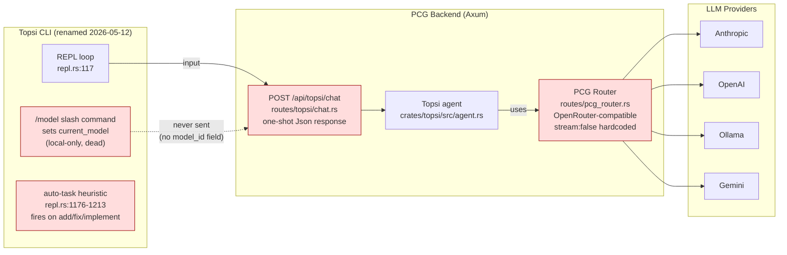
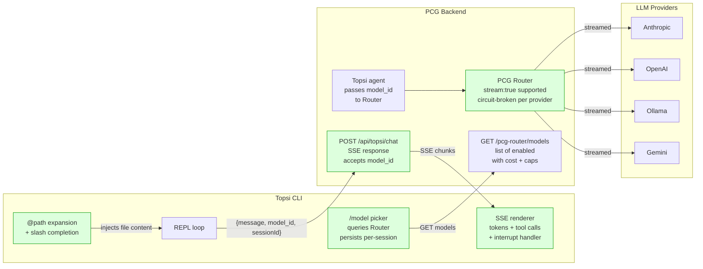
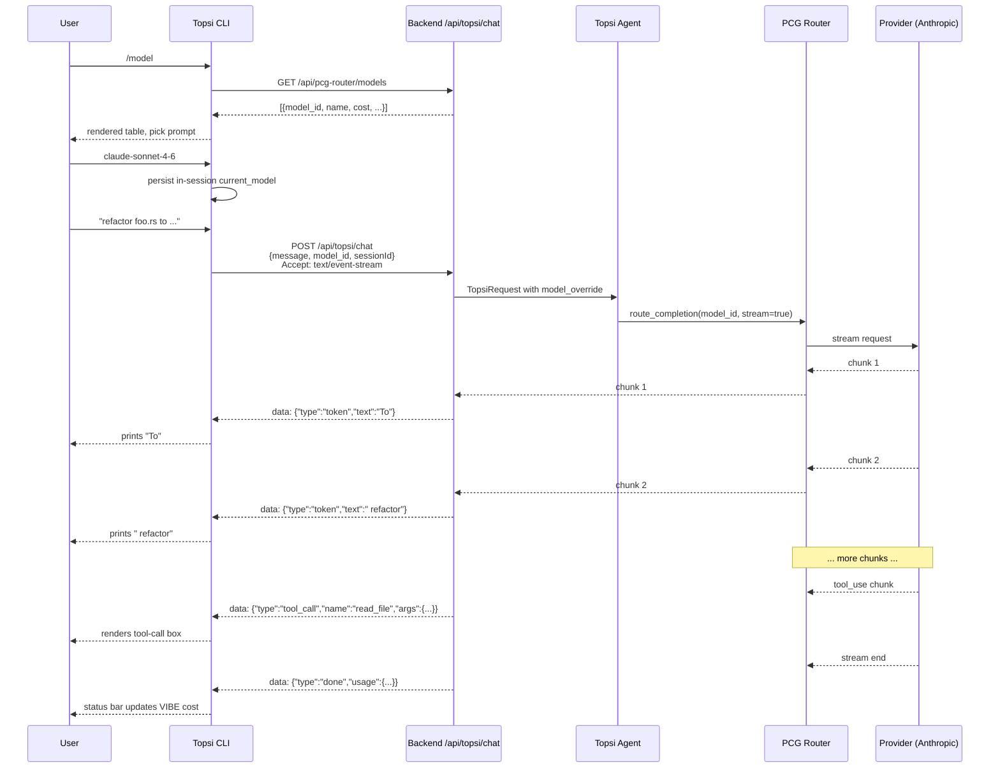
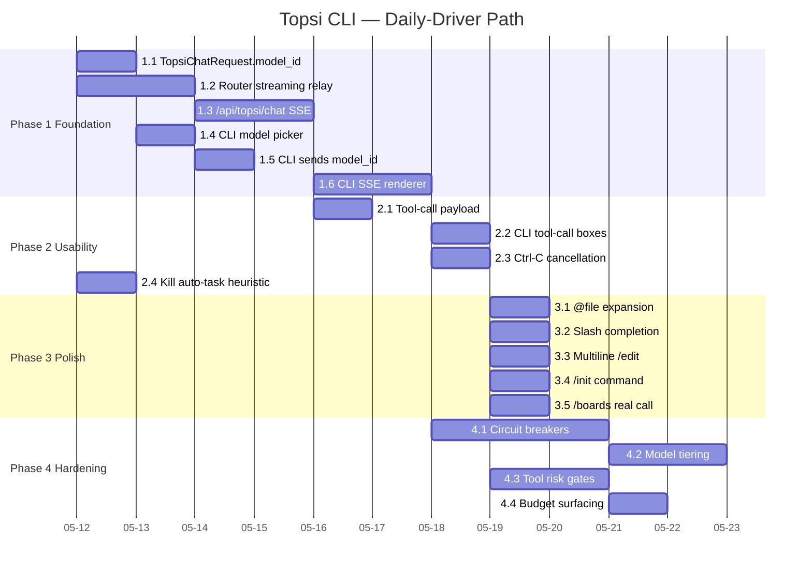

# Topsi CLI: PCG Router Integration and Daily-Driver Hardening

**Date**: 2026-05-12
**Branch**: `sloperation414`
**Worktree**: `/Users/sirakstudios/topos/pcg/github/pcg-cc-mcp` (root)
**Base**: `main`

---

## Executive Summary

The ORCHA-CLI was renamed to `topsi` and the crate moved to `crates/topsi-cli/` on 2026-05-12. The binary builds clean, lints clean (`-D warnings`) and connects to the running backend. Triage against Claude Code surfaced ten concrete inefficiencies. The headline gap is that `TopsiChatRequest` has no `model_id` field, so the CLI's `/model` slash command sets a value the server never sees. This plan integrates the CLI with the existing **PCG Router** (`crates/server/src/routes/pcg_router.rs` — OpenRouter-compatible LLM routing layer), wires real-time streaming through Topsi, closes every gap from the triage list and produces a CLI that can replace vanilla Claude Code for daily development.

Four phases. Phase 1 is the foundation that everything else depends on (Router integration plus streaming). Phase 2 makes the assistant usable (tool-call rendering, interrupt, auto-task fix). Phase 3 closes UX gaps (@file paste, /init, boards). Phase 4 is hardening that aligns with the 5-year roadmap's model-tiering and circuit-breaker work.

---

## Roadmap Alignment

This plan is downstream of three items already in the 5-year roadmap and research-derived backlog. We are not inventing new strategy — we are executing the CLI-shaped slice of work that the roadmap already endorses.

| Roadmap item | Source | This plan delivers |
|---|---|---|
| Automatic model routing (30-85% cost savings) | `planning/roadmap/architecture-gaps-analysis.md` §"Multi-Tier Model Routing" L124-132 | The CLI seam that surfaces Router-managed models to the operator. Manual routing first, automatic later. |
| Model tiering by agent role (Haiku for routing, Sonnet for analysis, Opus for complex) | `planning/roadmap/research-derived-backlog.md` §"Tier Models By Role" L20-21 | The mechanism for an operator to override the default tier per session via `/model`. |
| LLM provider circuit breakers | `planning/roadmap/research-derived-backlog.md` L250 + arch-gaps L402-408 | Phase 4 hardening — out of scope for daily-driver MVP, sequenced in. |
| CAPO instrumentation surfaced in UI | `planning/roadmap/research-derived-backlog.md` L314 | The CLI status bar already shows VIBE cost; we extend it to per-turn token + cost breakdown. |
| FinOps guardrails (loop/token/tool-call caps) | `planning/roadmap/research-derived-backlog.md` L321 | Phase 4 alignment — backend feature, CLI surfaces it. |

The 5-year roadmap (`planning/roadmap/5-year-product-roadmap.md`) does not name a CLI deliverable explicitly. Stage 0 ("Dogfood and Capture") targets PCG running 100% of internal workflows through the platform. A CLI is the highest-leverage way to do that for engineering work specifically, since the team currently lives in Claude Code. This plan reframes the CLI as a Stage 0 dogfooding instrument that also exercises every Router and Topsi feature the platform claims to support.

---

## Current Architecture



**Red boxes are the broken or incomplete seams.** The CLI knows about models but cannot influence them. The Topsi chat endpoint is one-shot. The PCG Router declares streaming support but forces `stream:false`. The auto-task heuristic fires on prompt-shaped natural language.

---

## Target Architecture



---

## Consolidated Triage (10 inefficiencies)

| # | Gap | Severity | Phase | Root cause |
|---|---|---|---|---|
| 1 | `TopsiChatRequest` has no `model_id` field — CLI `/model` is dead | **Critical** | 1 | Server-side schema gap. `routes/topsi/mod.rs:416` |
| 2 | PCG Router hardcodes `stream:false` despite accepting the flag | **High** | 1 | `routes/pcg_router.rs:270,456,491` — passthrough not implemented |
| 3 | `/api/topsi/chat` returns `Result<Json<...>>` — no SSE | **High** | 1 | `routes/topsi/chat.rs:11` — one-shot response type |
| 4 | Tool calls show name only, not args or results | **High** | 2 | `crates/topsi-cli/src/api.rs:368-375` — extracts `toolName` field only; backend payload likely richer |
| 5 | No interrupt — Ctrl-C only prints a hint | **Medium** | 2 | `crates/topsi-cli/src/repl.rs:150-155` — no cancel-in-flight wiring |
| 6 | Auto-task heuristic fires on prompt-shape | **Medium** | 2 | `crates/topsi-cli/src/repl.rs:1176-1213` — naive prefix match |
| 7 | No `@file` expansion, no slash completion menu, no multiline | **Medium** | 3 | `repl.rs` uses `rustyline` defaults; no helper hook |
| 8 | `/boards` API stub | **Low** | 3 | `crates/topsi-cli/src/api.rs:173` — TODO comment |
| 9 | No `/init`-style codebase intro | **Low-Med** | 3 | Missing CLAUDE.md ingestion before first turn |
| 10 | No per-provider circuit breakers, no model tiering by role | **Medium** | 4 | Roadmap-level — Router has the registry, not the policy |

---

## Phase 1 — Foundation: Router Integration and Streaming

**Goal:** Operator can pick any Router-registered model from the CLI, type a prompt and watch tokens stream in. This is the headline feature and unblocks everything else.



### Tasks

#### 1.1 Backend: extend `TopsiChatRequest` and plumb override into handle_chat
**Revised approach** (see OQ1): per-turn `LLMClient` construction when override is set; static `self.llm` is the fallback.
- File `crates/server/src/routes/topsi/mod.rs:416`: add `pub model_id: Option<String>` to `TopsiChatRequest`
- File `crates/server/src/routes/topsi/chat.rs:6`: extract `request.model_id` and inject into `TopsiRequestType::Chat`; this requires adding a `model_id_override: Option<String>` field to `TopsiRequestType::Chat` (in `crates/topsi/src/types.rs` or wherever the enum lives — confirm during implementation)
- File `crates/topsi/src/agent.rs:530-533`: forward the override into `handle_chat`'s new parameter
- File `crates/topsi/src/agent.rs:596` (`handle_chat`): take `model_override: Option<&str>`; when `Some`, lookup `PcgRouterModel::get_by_model_id(&pool, override_id)` and build an ad-hoc `LLMClient` from its provider/model/api_key_env_var; use that client for this turn's `generate_with_tools_and_history` calls
- Helper: extract `fn build_llm_from_router_model(model: &PcgRouterModel) -> Result<LLMClient>` so this is reusable for other Topsi entrypoints later
- Regenerate types: `npm run generate-types` from project root

#### 1.2 Backend: implement Router streaming
- File: `crates/server/src/routes/pcg_router.rs`
- Lines `270`, `456`, `491` hardcode `stream: false` — replace the proxy path with a real SSE relay when caller asks for streaming
- Use `axum::response::sse::{Sse, Event}` and `tokio_stream::StreamExt` to pipe chunks
- For providers that return SSE natively (Anthropic, OpenAI), tee the upstream stream into Server-Sent Events with our normalized event types: `token`, `tool_call`, `tool_result`, `done`, `error`
- For Ollama (which returns NDJSON), translate to the same event types
- Test path: `curl -N -X POST .../v1/chat/completions -d '{"model":"...","stream":true,...}'` should print events live

#### 1.3 Backend: convert `/api/topsi/chat` to SSE
- File: `crates/server/src/routes/topsi/chat.rs`
- Change return type from `Result<Json<TopsiResponse>, ApiError>` to `Sse<impl Stream<Item = Result<Event, axum::Error>>>`
- Topsi agent's `process_request` likely batches today — refactor or wrap it so it can emit incremental events
- Event types: `token` (text delta), `tool_call` (`{toolName, args}`), `tool_result` (`{toolName, result_excerpt}`), `usage` (`{inputTokens, outputTokens}`), `done`, `error`
- VIBE accounting still happens server-side at stream end (`record_llm_vibe_usage` at end of stream rather than after `process_request`)

#### 1.4 CLI: model picker pulling from Router
- File: `crates/topsi-cli/src/api.rs`
- Add `pub async fn list_router_models(&self) -> Result<Vec<RouterModel>>` hitting `GET /api/pcg-router/models`
- Reuse the `PcgRouterModel` shape via a CLI-local struct (we cannot depend on the `db` crate from the CLI without pulling sqlx — define a minimal mirror struct)
- File: `crates/topsi-cli/src/repl.rs:304-414` (current `/model` handler)
- Replace hardcoded `ollama|openai|anthropic|set` subcommands with:
  - `/model` — list with selection prompt (numbered, current default highlighted)
  - `/model <id-or-substring>` — set; substring picks if unambiguous
  - `/model default` — clear override, use Topsi's configured default

#### 1.5 CLI: send `model_id` on every chat request
- File: `crates/topsi-cli/src/api.rs:350-355` (the `chat_with_topsi` builder)
- Add `"modelId": current_model` to the JSON body when override is present
- File: `crates/topsi-cli/src/repl.rs:1241` — pass `self.current_model.clone()` into the call

#### 1.6 CLI: SSE renderer
- File: `crates/topsi-cli/src/api.rs`
- Add `pub async fn chat_with_topsi_streaming(&self, ..., on_event: F) -> Result<UsageSummary>` where `F: FnMut(StreamEvent)`
- Use `reqwest::Response::bytes_stream()` and parse SSE manually (or pull in `eventsource-stream` crate — single dep, ~150 LOC)
- Event types parsed back into `StreamEvent::{Token(String), ToolCall{name, args}, ToolResult{...}, Usage{...}, Done, Error(String)}`
- File: `crates/topsi-cli/src/repl.rs:1237-1290`
- Replace the awaited `chat_with_topsi` call with the streaming version; print tokens as they arrive without trailing newline; tool calls render in a colored box mid-stream

### Acceptance for Phase 1
- [ ] `topsi /model` lists models from PCG Router with cost and context window
- [ ] Choosing a model survives across turns in the same REPL session
- [ ] Typing a prompt prints tokens as they arrive (visible streaming)
- [ ] Backend logs show the chosen `model_id` reached the Router
- [ ] VIBE cost in the status bar updates only after stream end
- [ ] `cargo build --workspace` and `cargo clippy --workspace -- -D warnings` green
- [ ] `npm run generate-types:check` clean

---

## Phase 2 — Usability: Tool Calls, Interrupt and Auto-Task

**Goal:** You can see what Topsi did and stop it when you want to.

### Tasks

#### 2.1 Backend: enrich tool-call SSE payload
- File: `crates/server/src/routes/topsi/chat.rs` and wherever Topsi emits tool events
- Each `tool_call` event ships `{toolName, args, callId}`; each `tool_result` ships `{callId, ok, excerpt}` where `excerpt` is at most 4 KB of the result string
- Server-side log full result; wire only the excerpt over SSE to bound payload size

#### 2.2 CLI: tool-call rendering
- File: `crates/topsi-cli/src/output.rs`
- New `fn print_tool_call_box(&self, name: &str, args: &serde_json::Value, status: ToolStatus)` rendering:
  ```
  ╭─ read_file ──────────────────────────────────────╮
  │ path: crates/server/src/routes/topsi/chat.rs     │
  │ (running...)                                     │
  ╰──────────────────────────────────────────────────╯
  ```
  Status flips to `(done, 14ms)` or `(failed: ...)` on `tool_result`
- Args render as key=value lines, truncated at 80 cols
- Match exactly the Claude-Code-style boxes the user is already trained on

#### 2.3 CLI: Ctrl-C aborts in-flight request
- File: `crates/topsi-cli/src/repl.rs`
- Wrap the streaming call in `tokio::select! { _ = chat() = ..., _ = ctrl_c() = ... }`
- On Ctrl-C during a stream: drop the response future (closes the connection — backend should be tolerant), print `^C` and a "(interrupted)" line, return to the prompt
- Server side: the SSE handler must be cancellable. `axum::Sse` honors client disconnect by default — verify under load

#### 2.4 CLI: kill the auto-task heuristic
- File: `crates/topsi-cli/src/repl.rs:1176-1213`
- Remove the heuristic entirely
- Add `auto_create_tasks: bool` to config (already exists in `crates/topsi-cli/src/config.rs:59`) and default it to `false`
- Replace the heuristic with an explicit `/task auto on|off|status` slash-subcommand
- When auto is on, only create a task when the user's input begins with a literal `task:` prefix — explicit signal, not pattern match

### Acceptance for Phase 2
- [ ] Tool calls render with args and complete with success/failure markers
- [ ] Ctrl-C during a stream cleanly returns to the prompt, server disconnects gracefully (check `tracing::warn` for an orphaned task)
- [ ] Typing "fix the layout bug" does NOT create a task; typing "task: fix layout bug" does
- [ ] `topsi config --set session.auto_create_tasks=true` works and changes the default

---

## Phase 3 — Polish: File Refs, /init, Boards

**Goal:** Friction drops to zero for the workflows we actually run.

### Tasks

#### 3.1 CLI: `@path` file expansion
- File: `crates/topsi-cli/src/repl.rs`
- Pre-process input: any token matching `@<path>` is replaced inline with a fenced block:
  ```
  <attached path="crates/foo/bar.rs">
  ...file contents...
  </attached>
  ```
- Cap each file at 64 KB (truncate with `... [truncated, N bytes]`); cap total at 256 KB across the message
- Use `git ls-files` or fall back to direct stat so paths are validated against the worktree

#### 3.2 CLI: slash-command completion menu
- Switch `rustyline` `Editor` to use a `Completer` trait impl
- Suggest from a static list of slash commands plus subcommands; suggest project names for `/project`; suggest model substrings for `/model` (cached from last fetch)
- Tab triggers completion, double-Tab cycles options

#### 3.3 CLI: multiline input
- Add `/edit` slash command that opens `$EDITOR` ($VISUAL fallback) on a tempfile; on close, the file content becomes the next prompt
- Cheaper alternative to implementing in-place multiline in rustyline

#### 3.4 CLI: `/init` codebase intro
- New slash command: `/init`
- Walks the working dir for `CLAUDE.md`, `AGENTS.md`, top-level `README.md` and a `package.json`/`Cargo.toml` summary
- Sends a structured intro message to Topsi: "I am about to start a session in this codebase. Here is the orientation. Acknowledge briefly and wait for my first task."
- Stores the intro response so it persists for the session

#### 3.5 CLI: implement `/boards`
- File: `crates/topsi-cli/src/api.rs:173`
- Replace the TODO with a real `GET /api/boards?projectId=...` call
- Render with the existing `print_kanban_columns` output helper

### Acceptance for Phase 3
- [ ] `@crates/server/src/main.rs` in a prompt attaches that file's contents
- [ ] Tab completes slash commands and known model substrings
- [ ] `/edit` opens `$EDITOR` and the saved buffer becomes the prompt
- [ ] `/init` produces an acknowledgement and the session feels primed
- [ ] `/boards` renders a real Kanban view

---

## Phase 4 — Hardening (Roadmap-aligned)

These items align with the 5-year roadmap and research-derived backlog. They are not strictly required for daily-driver replacement but they close the remaining gap to "production CLI for paying clients."

### Tasks

#### 4.1 Per-provider circuit breakers in PCG Router
- File: `crates/server/src/routes/pcg_router.rs`
- Add a `CircuitBreaker` per `(provider, model_id)` with closed → open → half-open transitions on 429/502/503/timeout
- When tripped, route to the next-priority model of the same tier (per `PcgRouterModel.priority`)
- Telemetry: `topsi.router.circuit.{closed|open|half_open}` counters
- Reference pattern: `tower` middleware or the `backon` crate for retry; circuit-breaker logic written by hand or via `tower::limit::RateLimitLayer` analog

#### 4.2 Model tiering by role
- Backend: extend `PcgRouterModel` with a `tier` enum (`cheap`, `mid`, `expensive`) — research-backlog L20-21 names them Haiku/Sonnet/Opus class
- Topsi agent: when no `model_id` override, choose by request shape: short message → cheap, multi-turn analysis → mid, complex coding → expensive
- CLI: `/model tier cheap|mid|expensive` as a soft hint that the backend respects

#### 4.3 Per-tool risk gating
- Topsi backend already groups tools by risk level — `crates/server/src/routes/topsi/admin.rs:214` exposes the grouping
- CLI: when a `tool_call` event has `risk: high`, pause the stream and prompt the operator inline: `[y] approve  [n] skip  [a] always for this session  [q] cancel`
- Server side: introduce a "two-phase" tool call protocol — `tool_call_request` → wait for `tool_call_approve` → `tool_call_result`

#### 4.4 FinOps guardrails surfaced in CLI
- Backend: configurable per-session caps from research-backlog L321 (loop, token, tool-call, wall-clock, project-budget)
- CLI: `/budget show` displays current caps and consumption; warning at 80%; hard stop at 100% with explicit override prompt

### Acceptance for Phase 4
- [ ] Provider outage during a session falls over to a sibling model without user-visible failure
- [ ] `topsi /model tier cheap` measurably reduces VIBE cost on triage-shaped prompts
- [ ] High-risk tool calls require explicit approval
- [ ] `/budget show` reflects backend caps and current spend

---

## Testing Strategy

### Per-phase smoke harness
- Add `e2e/topsi-cli.spec.ts` that spawns `topsi` against a seeded backend and asserts golden-path interactions
- Use the test seed at `dev_assets_seed/test-seed.sqlite` (admin user, org, pipeline stages — per `pcg-cc-mcp/CLAUDE.md`)
- Run with `FRONTEND_PORT=<isolated> npx playwright test e2e/topsi-cli.spec.ts`

### Backend integration tests
- New `crates/server/tests/topsi_chat_sse.rs` — end-to-end SSE assertion: connect, send message, parse 5+ event types, verify `usage` shape, verify cancellation cleanup
- New `crates/server/tests/pcg_router_stream.rs` — assert SSE relay for at least one provider mock (use a local HTTP mock — `wiremock` crate already a workspace dep candidate)

### CLI unit tests
- `crates/topsi-cli/src/api.rs` — table-test the SSE event parser with golden chunks from each provider
- `crates/topsi-cli/src/repl.rs` — extract the `@path` expander to a pure function and table-test edge cases (missing file, oversize file, escaped @)

### Manual dogfood gate
- Before Phase 1 ships: spend one full hour using the CLI for a real task you would have used Claude Code for
- Capture friction in a notes file at `planning/2026-05-12--notes--topsi-cli-dogfood.md` (created on first session)
- A gap that surfaces during dogfood gets a row in the consolidated triage table above

---

## Sequencing and Dependencies



Critical path is **1.2 → 1.3 → 1.6** (Router streaming → Topsi SSE → CLI renderer). Everything else parallelizes around it. Phase 4 items can start as soon as Phase 1 is done since they are server-side.

---

## Risk Register

| Risk | Likelihood | Impact | Mitigation |
|---|---|---|---|
| Topsi agent's `process_request` is internally batched and resists incrementalization | Medium | Schedule slip on 1.3 | Read `crates/topsi/src/agent.rs::process_request` before starting 1.3 — if it is batched, scope a wrapper that emits a single `token` event for now and a real stream later |
| Ollama provider returns NDJSON not SSE, requires per-provider adapter | High | Adds 0.5-1d to 1.2 | Plan for an adapter trait `ProviderStream: Stream<Item = StreamEvent>`; one impl per provider type |
| `reqwest::Response::bytes_stream()` SSE parsing has edge cases (split chunks, partial frames) | Medium | Garbled CLI output | Use `eventsource-stream` crate rather than hand-roll; budget 0.25d to evaluate |
| Cancellation leaks server-side LLM cost (provider keeps generating after client drops) | High | VIBE accounting wrong | On client disconnect, the SSE handler must drop the upstream future too; verify with `tracing::warn` on dropped streams; provider bills only what we read |
| Auto-task heuristic removal breaks an existing user's workflow | Low | Behavior change | Tool is dormant per planning audit; ship behind the config toggle defaulted off |
| `npm run generate-types` produces a TS diff that breaks frontend builds | Medium | CI red | Run `npm run generate-types:check` before commit, fix frontend usages of `TopsiChatRequest` in same PR |
| Plan creep — Phase 4 items become "must-have" mid-implementation | Medium | Ship date slip | This plan explicitly bounds Phase 1+2 as daily-driver MVP; Phase 3+4 ship in follow-up PRs |

---

## Open Questions — Resolved 2026-05-12

### OQ1. Does the Topsi agent accept a model override internally?
**No.** Topsi holds a single `Option<LLMClient>` at `crates/topsi/src/agent.rs:304`, built once from `config.llm` at startup (lines 392-415). `handle_chat` calls `self.llm.generate_with_tools_and_history()` (line 674); the underlying method in `crates/nora/src/brain/mod.rs:443` dispatches only on the client's fixed `self.config.provider`. No per-call override path exists.

**Implication for Phase 1.1 — revised approach:** Build a fresh `LLMClient` per turn when an override is present, lookup data sourced from `PcgRouterModel::get_by_model_id`. The static `self.llm` remains the fallback when no override is set. This is localized to `handle_chat` and avoids the larger surgery of refactoring `LLMClient` itself or migrating Topsi to call PCG Router via HTTP. The HTTP migration (architecturally correct long-term) is deferred to a follow-up plan.

### OQ2. Should `topsi` be added to `pnpm run dev`?
**No.** Keep it out. The dev orchestration is for the backend+frontend server combo; the CLI is an operator tool that wants its own terminal. The `.flox activate` alias is the right surface. Operators run `topsi` in a separate pane after `pnpm run dev` is up.

### OQ3. Should the CLI support GitHub OAuth device-flow?
**Defer.** Username/password against the JWT login endpoint is sufficient for dogfood and even for trusted external operators (Aaren). Device-flow is a 1-2d project that competes with shipping Phase 1. Add an entry to `planning/BACKLOG--remaining-work.md` under "Topsi CLI hardening" and revisit before Stage 1 external pilots.

### OQ4. Local JSONL vs server-side conversation persistence?
**Keep both — they serve different purposes.** Server-side `session_history` (`crates/topsi/src/agent.rs:632-643`, bounded to 40 messages / 20 turns) is the LLM's working memory mid-session. Local JSONL via `ConversationLog::save()` is the operator's long-term searchable record. No consolidation needed. Phase 3 `/init` actually makes the local log more valuable as a session journal.

---

## Out of Scope

- Voice integration (`reference_nora_topsi_agents` memory notes there is an RN/Expo voice terminal — separate workstream)
- Mobile / Tauri / desktop packaging — CLI is terminal-only by design
- Replacing the dashboard's in-browser chat (different UX surface, different constraints)
- Cross-platform installers — `cargo install --path crates/topsi-cli` is the install story until Stage 1
- $TOPSI token integration — orthogonal to dev tooling

---

## Done Definition

Topsi CLI replaces Claude Code as the founder's daily driver when:
- Every triage gap is closed through Phase 1+2+3
- A full week of PCG engineering happens through `topsi` with no fallback to `claude` for non-blocked workflows
- The dogfood notes file shows fewer than three open friction items
- `cargo build --workspace`, `cargo clippy --workspace -- -D warnings`, `npm run check` all green
- One external operator (e.g. Aaren) can install and use it without help, end to end
